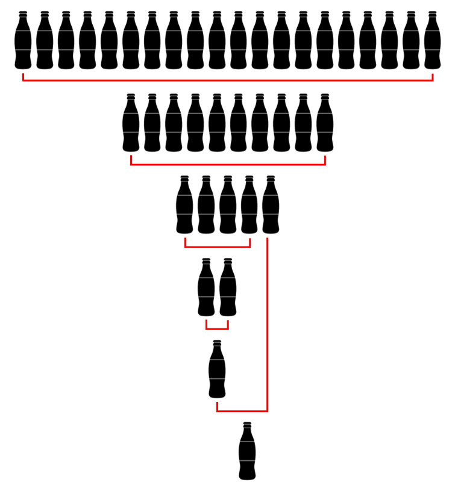

# Level 1 - 콜라 문제

## 문제

오래전 유행했던 콜라 문제가 있습니다. <br/>
콜라 문제의 지문은 다음과 같습니다.

>정답은 아무에게도 말하지 마세요. <br/>
>콜라 빈 병 2개를 가져다주면 콜라 1병을 주는 마트가 있다. 빈 병 20개를 가져다주면 몇 병을 받을 수 있는가?<br/>
>단, 보유 중인 빈 병이 2개 미만이면, 콜라를 받을 수 없다.<br/>

문제를 풀던 상빈이는 콜라 문제의 완벽한 해답을 찾았습니다. 상빈이가 푼 방법은 아래 그림과 같습니다. <br/>
우선 콜라 빈 병 20병을 가져가서 10병을 받습니다. 받은 10병을 모두 마신 뒤, 가져가서 5병을 받습니다. <br/>
5병 중 4병을 모두 마신 뒤 가져가서 2병을 받고, 또 2병을 모두 마신 뒤 가져가서 1병을 받습니다. <br/>
받은 1병과 5병을 받았을 때 남은 1병을 모두 마신 뒤 가져가면 1병을 또 받을 수 있습니다. <br/>
이 경우 상빈이는 총 10 + 5 + 2 + 1 + 1 = 19병의 콜라를 받을 수 있습니다.



문제를 열심히 풀던 상빈이는 일반화된 콜라 문제를 생각했습니다. <br/>
이 문제는 빈 병 a개를 가져다주면 콜라 b병을 주는 마트가 있을 때, <br/>
빈 병 n개를 가져다주면 몇 병을 받을 수 있는지 계산하는 문제입니다. <br/>
기존 콜라 문제와 마찬가지로, 보유 중인 빈 병이 a개 미만이면, 추가적으로 빈 병을 받을 순 없습니다. <br/>
상빈이는 열심히 고심했지만, 일반화된 콜라 문제의 답을 찾을 수 없었습니다. <br/>
상빈이를 도와, 일반화된 콜라 문제를 해결하는 프로그램을 만들어 주세요.

콜라를 받기 위해 마트에 주어야 하는 병 수 a, 빈 병 a개를 가져다 주면 <br/>
마트가 주는 콜라 병 수 b, 상빈이가 가지고 있는 빈 병의 개수 n이 매개변수로 주어집니다. <br/>
상빈이가 받을 수 있는 콜라의 병 수를 return 하도록 solution 함수를 작성해주세요.

## 제한 사항

1. 1 ≤ b < a ≤ n ≤ 1,000,000
2. 정답은 항상 int 범위를 넘지 않게 주어집니다.

## 풀이

```c#
using System;

public class Solution {
    public int solution(int a, int b, int n)
    {
        int totalNumberOfCoke = 0;

        while (n >= a)
        {
            int cokeToReceive = (n / a) * b;
            int leftoverCoke = 0;

            if (n % a != 0)
                leftoverCoke = n % a;

            totalNumberOfCoke += cokeToReceive;
            n = cokeToReceive + leftoverCoke;
        }

        return totalNumberOfCoke;
    }
}
```

해결 일자 - 2023.01.05

오늘 문제는 굉장히 쉬운 편에 속해서 매우 빠르게 해결할 수 있었다.

어떤 마트에서는 a개의 콜라 빈 병을 받으면 b개의 콜라를 돌려주는데, <br/>
이 때 n개의 콜라를 가져다 줄 경우 받을 수 있는 총 콜라의 개수를 구하는 문제이다.<br/>
1회 시도에서 받을 수 있는 콜라의 개수는 (n / a) * b개이다.

가져다 주는 콜라의 개수 n개를 계속 조절해가면서, 반환되는 콜라의 개수를 계속 더해주면 해결되는 간단한 문제이다.<br/>
이를 위해 while문을 사용해서, 조건을 n >= a로 설정했다.<br/>
n == a라면 마지막으로 b개의 콜라를 반환받고 while문을 나오게 될 것이다.

while문 내부에서는 이번에 받을 수 있는 콜라의 개수 cokeToReceive 변수를 선언하여 n / a * b를 대입해준다.<br/>
n이 a로 나누어 떨어지지 않는 경우, 남은 콜라는 다음에 쓸 수 있으므로 <br/>
해당 콜라를 저장할 leftoverCoke를 선언하여 나머지를 저장해준다.

그 후, 총 콜라의 개수인 totalNumberOfCoke에 cokeToReceive를 더해주고,<br/>
n에는 이번에 받은 콜라와 남은 콜라, 즉 cokeToReceive와 leftoverCoke를 더해서 다시 while문으로 돌아간다.