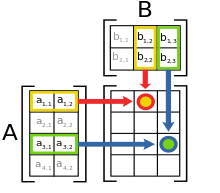

# Level 2 - 행렬의 곱셈

## 문제

2차원 행렬 arr1과 arr2를 입력받아, arr1에 arr2를 곱한 결과를 반환하는 함수, solution을 완성해주세요.

## 제한 사항

1. 행렬 arr1, arr2의 행과 열의 길이는 2 이상 100 이하입니다.
2. 행렬 arr1, arr2의 원소는 -10 이상 20 이하인 자연수입니다.
3. 곱할 수 있는 배열만 주어집니다.

## 풀이

```c#
using System;

public class Solution
{
    public int[,] solution(int[,] arr1, int[,] arr2)
    {
        int[,] answer = new int[arr1.GetLength(0), arr2.GetLength(1)];

        for (int i = 0; i < arr1.GetLength(0); i++)
        {
            for (int j = 0; j < arr1.GetLength(1); j++)
            {
                for (int k = 0; k < arr2.GetLength(1); k++)
                {
                    answer[i, k] += arr1[i, j] * arr2[j, k];
                }
            }
        }

        return answer;
    }
}
```

해결 일자 - 2023.01.24

행렬의 곱셈을 하는 메커니즘을 구현해야하는 문제이다. <br/>
단순하다고 생각했는데 생각보다 시간이 오래 걸렸다.

행렬의 곱셈은 두 행렬 각각의 열의 길이와 행의 길이가 같아야만 가능하다.<br/>
이 문제에서는 제한 조건에 곱할 수 있는 행렬만 가능하다고 명시되어 있기 때문에 고려할 필요가 없었지만<br/>
만약 그러한 조건이 없다면 반복문 시작 전에 별도의 조건문을 작성해주어야 한다.

곱한 행렬의 크기는 두 행렬 각각의 행과 열의 크기이다.<br/>
즉, 3\*2 배열과 2\*2 배열을 곱했다면, 곱한 행렬의 크기는 3\*2가 된다.<br/>
각 요소는 두 행렬의 행과 열의 요소들을 차례대로 곱해서 더한 값이다.

```c#
int[,] arr1 = new int[,] 
{ { 1, 4 }, 
  { 3, 2 }, 
  { 4, 1 } };

int[,] arr2 = new int[,] 
{ { 3, 3 }, 
  { 3, 3 } };
  ```

예를 들어, 이렇게 두 행렬이 존재한다고 가정했을 때,<br/>
결과값인 2차원 배열 arr3의 크기는 int[arr1.GetLength(0), arr2.GetLength(1)]이며<br/>
각 요소는 그 위치에 해당하는 행과 열의 요소들을 각각 더한 값이다.<br/>



이미지로 표현하자면 위와 같다.<br/>
즉, arr3[0, 0]의 값은 arr1[0, 0] * arr2[0, 0] + arr1[0, 1] + arr2[1, 0]이다.<br/>
arr3[0, 1]의 값은 arr1[0, 0] * arr2[0, 1] + arr1[0, 1] + arr2[1, 1]이다.

```c#
for (int i = 0; i < arr1.GetLength(0); i++)
{
    for (int j = 0; j < arr1.GetLength(1); j++)
    {
        for (int k = 0; k < arr2.GetLength(1); k++)
        {
            answer[i, k] += arr1[i, j] * arr2[j, k];
        }
    }
}
```

첫번째 반복문은 결과값이 될 행렬의 행의 크기를 나타낸다.<br/>
두번째 반복문은 첫번째 행렬의 각 행의 요소들이다.<br/>
세번째 반복문은 두번째 행렬의 각 열의 요소들이다.<br/>
세번째 반복문에서 결과값이 될 각 행의 요소들에 값을 더한다.