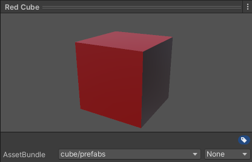
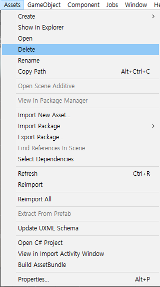

# AssetBundle 빌드하기

AssetBundle은 유니티로 일정 용량 이상의 게임을 빌드하려 할 때 거의 필수적으로 사용해야 하는 기능이다.
앱의 크기가 일정 이상이 되면 마켓에 올리는 것이 불가능하기도 하기 때문에, 용량을 분할하기 위해서도 사용하고,
또한 게임 업데이트를 위해서 사용하기도 하는 기능이다.

물론 지금에서야 AssetBundle의 개선판인 Addressable Asset을 유니티가 많이 홍보하고 있는 상황이지만,
Addressable Asset 시스템도 결국에는 AssetBundle을 더 사용하기 편하게 개선한 것이므로
AssetBundle에 대한 이해가 어느정도 있어야 Addressable Asset도 문제없이 사용할 수 있다고 생각한다.

그렇기에 간단하게 AssetBundle 시스템을 다루는 방법에 대해 정리해놓고자 한다.
우선 간단하게 AssetBundle을 빌드하고 그로부터 오브젝트를 다시 불러오는 방법을 2편으로 나누어 정리해보았다.


## 1. AssetBundle로 묶을 오브젝트 지정

우선, AssetBundle로 묶을 오브젝트들을 선정해서, 에디터의 Inspector창의 하단에 있는 AssetBundle을 지정해주면 된다.
자신이 만들고 싶은 경로 이름대로 만들면 된다. 매우 쉽고 간단하다.



위의 그림과 같이, AssetBundle 칸에 경로를 적으면 끝이다.
이 때, 위와 같이 'cube/prefabs'로 경로를 적으면, 하위 디렉토리도 지정해 줄 수 있음을 알아두자.
즉, 이 AssetBundle을 빌드하면, cube 폴더 아래의 prefabs라는 이름을 가진 AssetBundle에 포함될 것이다.

이런 식으로 반복해서, 자신이 AssetBundle로 묶고 싶은 각종 게임 오브젝트, 매터리얼, 텍스쳐 등을 묶어주면 된다.
같은 경로를 적는다면 당연히 같은 번들에 묶일 것이다.


## 2. AssetBundle 빌드하기

```C#
using UnityEngine;
using UnityEditor;
using System.IO;

public class AssetBundleBuilder : MonoBehaviour
{
#if UNITY_EDITOR
    [MenuItem("Assets/Build AssetBundle")]
    public static void BuildAssetBundle()
    {
        // 에셋번들을 생성할 경로
        string assetBundleDirectory = "Assets/AssetBundles";

        if (!Directory.Exists(assetBundleDirectory))
        {
            Directory.CreateDirectory(assetBundleDirectory);
        }

        BuildPipeline.BuildAssetBundles(assetBundleDirectory, BuildAssetBundleOptions.None, BuildTarget.Android);
        AssetDatabase.Refresh();
    }
#endif
}
```

위의 코드는 유니티 에디터상에서 AssetBundle을 빌드해줄 메뉴를 만들어주는 코드이다.
위와 같이 코드를 작성하고, 유니티 에디터가 컴파일을 마치면 



위의 그림과 같이 MenuItem에 지정한 경로에 Build AssetBundle이라는 메뉴가 생성된다.
해당 메뉴를 선택하면 BuildAssetBundle 메서드가 실행된다.

assetBundleDirectory 또한 AssetBundle을 생성하고 싶은 경로로 자유롭게 지정하면 된다.
Directory.Exists를 통해 해당 경로가 존재하는지 검사하고,
만약 없다면 Directory.CreateDirectory를 통해 해당 경로에 AssetBundles 폴더를 생성한다.

BuildPipeline.BuildAssetBundles의 매개변수로는 첫번째로 우선 AssetBundle을 생성할 경로, 즉 assetBundleDirectory를 넘겨준다.
두 번째 매개변수인 BuildAssetBundleOptions는 AssetBundle의 압축 방식을 지정하는 것이다.
세 번째 매개변수인 BuildTarget은 빌드한 에셋번들을 사용하는 기기를 지정하는 것이다.
예를 들자면, 이렇게 빌드한 게임을 안드로이드에서 플레이한다면 BuildTarget.Android가 될 것이다.

BuildAssetBundleOptions과 BuildTarget에 대해서 더 자세히 알아보려면 유니티 공식 문서 등을 참고하도록 하자.

[AssetBundle 빌드 옵션](https://docs.unity3d.com/kr/2021.1/Manual/AssetBundles-Building.html)
