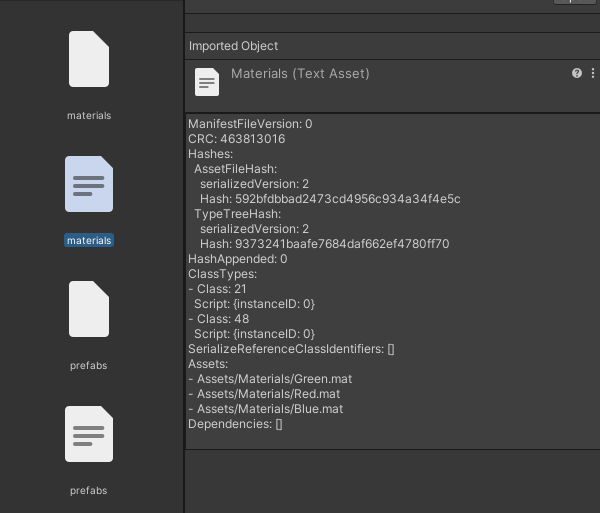
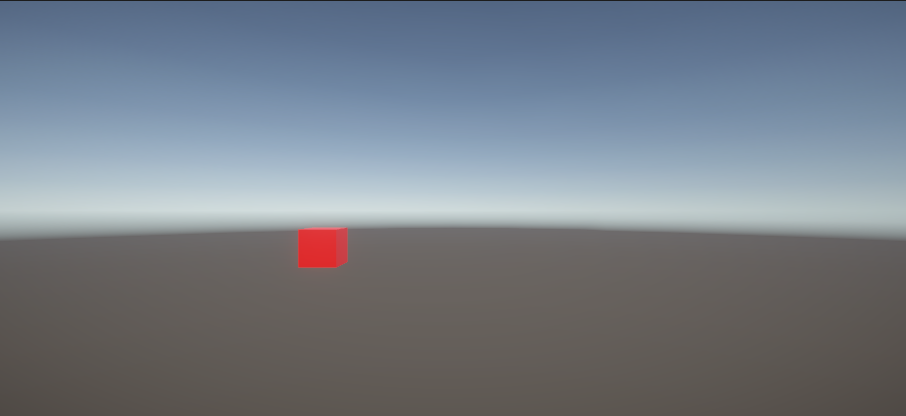
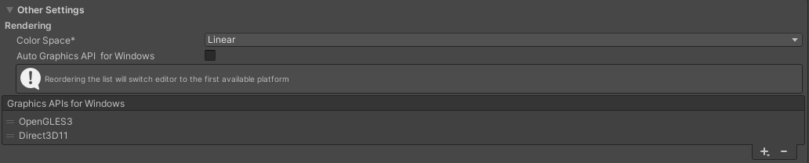

# AssetBundle로부터 오브젝트 불러오기

```C#
using System.Collections;
using System.Collections.Generic;
using System.IO;
using UnityEngine;

public class AssetBundleLoader : MonoBehaviour
{
    string path = "Assets/AssetBundles/";

    public AssetBundle LoadFromMemoryAsync(string bundleName)
    {
        AssetBundleCreateRequest request = AssetBundle.LoadFromMemoryAsync(File.ReadAllBytes(path + bundleName));
        if (request == null)
        {
            return null;
        }

        AssetBundle assetBundle = request.assetBundle;
        return assetBundle;
    }

    void Start()
    {
        AssetBundle materials = LoadFromMemoryAsync("cube/materials");
        AssetBundle prefabs = LoadFromMemoryAsync("cube/prefabs");

        var cube = prefabs.LoadAsset<GameObject>("Red Cube");
        Instantiate(cube);

        
        AssetBundle assetBundle = AssetBundle.LoadFromFile(Path.Combine(path, "AssetBundles"));
        AssetBundleManifest assetBundleManifest = assetBundle.LoadAsset<AssetBundleManifest>("AssetBundleManifest");

        string[] dependencies = assetBundleManifest.GetAllDependencies("cube/prefabs");
        foreach (string dependency in dependencies)
        {
            Debug.Log(dependency);
        }
    }
}
```

빌드된 AssetBundle로부터 게임 오브젝트를 로딩하려 할 때 참고할 수 있는 코드이다.

## 1. AssetBunlde 불러오기 및 오브젝트 생성

```C#
public AssetBundle LoadFromMemoryAsync(string bundleName)
{
    AssetBundleCreateRequest request = AssetBundle.LoadFromMemoryAsync(File.ReadAllBytes(path + bundleName));
    if (request == null)
    {
        return null;
    }

    AssetBundle assetBundle = request.assetBundle;
    return assetBundle;
}
```

우선 위의 LoadFromMemoryAsync 메서드에서 'Assets/AssetBundles/' 하위에 존재하는 AssetBundle의 경로를 매개변수로 넘겨준다.<br />
예를 들자면, 'Assets/AssetBundles/cube/prefabs'로 지정된 에셋번들을 불러오려면, 매개변수로 "cube/prefabs"를 주면 된다.<br />
그러면 AssetBundleCreateRequest를 통해 AssetBundle.LoadFromMemoryAsync로 AssetBundle을 불러오고,<br />
이를 다시 AssetBundle형의 변수에 대입하여 반환한다.

그러면 반환값으로 AssetBundle을 받게 되니, 이런 식으로 활용할 수 있다.

```C#
AssetBundle materials = LoadFromMemoryAsync("cube/materials");
AssetBundle prefabs = LoadFromMemoryAsync("cube/prefabs");

var cube = prefabs.LoadAsset<GameObject>("Red Cube");
Instantiate(cube);
```

위의 경우, 각 경로에 존재하는 AssetBundle을 각각의 AssetBundle형 변수에 캐싱해두었다.<br />
그 후, prefabs AssetBundle에서 LoadAsset을 통해 해당 번들에서 불러오려는 에셋의 타입을 제네릭으로 명시해주고,<br />
거기에 매개변수로 해당 에셋의 이름을 넘겨주면 AssetBundle 내부에서 해당 오브젝트를 불러올 수 있다.

## 2. AssetBundle 의존성(Dependency) 확인하기

에셋번들을 통해 어떠한 게임 오브젝트를 인스턴스화하려고 할 때 가장 중요한 것이 있다.<br />
바로 해당 오브젝트가 작동하는데 필요한 모든 준비 재료를 갖춰줘야 한다는 것이다.<br />
예를 들어서, 위의 코드같은 경우는, 프리팹으로 만들어 놓은 빨간 큐브 오브젝트를 불러오기 위해, <br />
해당 오브젝트에 필요한 빨간색 매터리얼을 먼저 불러오고 있다.

만약 위 코드에서 빨간색 큐브 프리팹을 인스턴스화하기 전에<br />
(Instantiate로 cube를 생성하기 이전에)

```C#
AssetBundle materials = LoadFromMemoryAsync("cube/materials");
```

위의 코드를 생략하여 매터리얼을 불러오지 않았다면, 큐브 프리팹은 생성은 되지만 매터리얼이 존재하지 않아 마젠타색으로 나타날 것이다.<br />
즉, AssetBundle 간의 **의존성(Dependency)**을 잘 파악하여, 상황마다 필요한 AssetBundle을 미리 준비해놓는 것이 중요하다.<br />
AssetBundle 간의 의존성은 Inspector 상에서도 확인할 수 있다.



위의 그림과 같이, AssetBundle의 정보가 담긴 파일(manifest)이 같이 생성되므로, <br />
필요한 오브젝트를 모두 번들로 잘 묶어서 빌드해두었다면, 이를 통해 의존성 구조를 파악할 수 있다.

```C#
AssetBundle assetBundle = AssetBundle.LoadFromFile(Path.Combine(path, "AssetBundles"));
AssetBundleManifest assetBundleManifest = assetBundle.LoadAsset<AssetBundleManifest>("AssetBundleManifest");

string[] dependencies = assetBundleManifest.GetAllDependencies("cube/prefabs");
foreach (string dependency in dependencies)
{
    Debug.Log(dependency);
}
```

혹은 이와 같이 AssetBundleManifest API를 통해 AssetBundle간의 의존성을 파악하고 번들을 불러오는 것도 가능하다.

AssetBundle을 생성한 경로에는 AssetBundle 전체에 관한 정보가 담긴 파일이 생성된다. <br />
즉, 이 예제의 경우에는 'Assets/AssetBundles'에 AssetBundles와 AssetBundles.manifest가 생성되는데,<br />
이 AssetBundles.manifest를 통해 번들간의 의존성을 파악하고 에셋을 로딩하는 것이 가능하다.

```C#
AssetBundle assetBundle = AssetBundle.LoadFromFile(Path.Combine(path, "AssetBundles"));
```

이 코드를 통해 AssetBundles라는 이름을 지는 번들을 불러와서, 해당 번들의 manifest 파일을 읽어오는 것이다.

```C#
AssetBundleManifest assetBundleManifest = assetBundle.LoadAsset<AssetBundleManifest>("AssetBundleManifest");
```

참고로, 이 때 LoadAsset의 매개변수 "AssetBundleManifest"는 매번 저대로 적으면 된다고 한다.<br />
이렇게 읽어온 manifest를 통해, 특정한 번들이 의존하고 있는 번들을 파악할 수 있다.<br />
GetAllDependencies 메서드에 자신이 지정한 번들의 이름을 넘겨주면, 이를 string 배열로 반환해주는데,<br />
그를 읽어서 필요한 번들을 모두 불러올 수 있겠다.

위의 예제의 foreach문에서는 단순히 콘솔창 출력을 통해 확인하기 위해서 Debug.Log를 사용하고 있지만,<br />

```C#
AssetBundle.LoadFromFIle(Path.Combine(assetBundlePath, dependency));
```

해당 코드를 이와 같이 바꾸면 의존 관계의 번들을 모두 불러올 수 있을 것이다.

```C#
AssetBundle prefabs = LoadFromMemoryAsync("cube/prefabs");
AssetBundle assetBundle = AssetBundle.LoadFromFile(Path.Combine(path, "AssetBundles"));
AssetBundleManifest assetBundleManifest = assetBundle.LoadAsset<AssetBundleManifest>("AssetBundleManifest");

string[] dependencies = assetBundleManifest.GetAllDependencies("cube/prefabs");
foreach (string dependency in dependencies)
{
    // Debug.Log(dependency);
    AssetBundle.LoadFromFile(Path.Combine(path, dependency));
}

var cube = prefabs.LoadAsset<GameObject>("Red Cube");
Instantiate(cube);
```



실제로, Start문을 위와 같이 바꾸고 플레이 모드를 실행해보았더니 정상적으로 오브젝트가 나타나는 것을 볼 수 있었다.


### BuildTarget에 따른 에디터 참고 사항

참고로 덧붙이자면, 처음에는 cube 프리팹에 사용할 매터리얼과 cube 프리팹들 전부를 <br />
그냥 하나의 cube라는 이름을 가진 번들로 묶었는데<br />
이렇게 하니 cube를 로딩할 때 이상하게 매터리얼이 제대로 로딩이 되지 않았다.<br />
분명 같은 번들 안에 묶여있기 때문에, 번들이 로딩된다면 필요한 에셋이 모두 로딩된 것일텐데<br />
혹시 번들을 분할하여 필요한 에셋들을 순차적으로 로딩해줘야 하는것인가 하는 생각이 들었다.

그러나 다른 사람들의 사례를 확인해보니, 이것은 번들의 로딩 순서가 아니라 다른 문제에 의해서 그런 것이었다.<br />
어떠한 문제인가 하면, 앞서 BuildTarget을 Android로 지정했는데,<br />
이런 경우, PC 에디터 환경에서는 AssetBundle로부터 매터리얼이 제대로 로딩이 되지 않는 현상이 있다고 한다.<br />
그럴 때에는 'Build Setting - Player Setting'에서 아래와 같이 처리해주니 매터리얼이 제대로 적용되었다.



Auto Graphics for Windows를 체크 해제 후, OpenGLES3을 추가해 준 후 최상단으로 배치하면 에디터를 재시작하게 된다.<br />
이후부터는 매터리얼이 제대로 적용되는 것을 볼 수 있었다.<br />
Windows가 아닌 다른 플랫폼의 경우에도 비슷하게 문제를 해결할 수 있지 않을까 싶다.


### AssetBundle 관련 참고 자료

유니티 에반젤리스트 오지현님의 2017년도 Unite Seoul 강연을 참고하면 좋다.<br />
[Unite Seoul 2017 에셋번들이 번들번들 : 에셋번들 실용 가이드](https://www.youtube.com/watch?v=Z9LrkQUDzJw)<br />
다만, 해당 강연의 경우 아무래도 2017년도 강의이기 때문에, AssetBundle의 기본 지식을 쌓는 데에는 유용하지만<br />
해당 강연을 통해서 AssetBundle에 대한 기본적인 지식을 갖춘 후, 최신 블로그 글 등을 한번 살펴보는 것이 좋다.

또한 2018년도 Unite Seoul의 에셋번들 실전 가이드 강연도 참고하면 좋다.<br />
[Unite Seoul 2018 에셋번들 실전 가이드](https://www.youtube.com/watch?v=Lx61ZEKEvnQ)