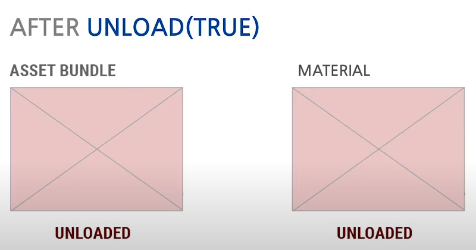
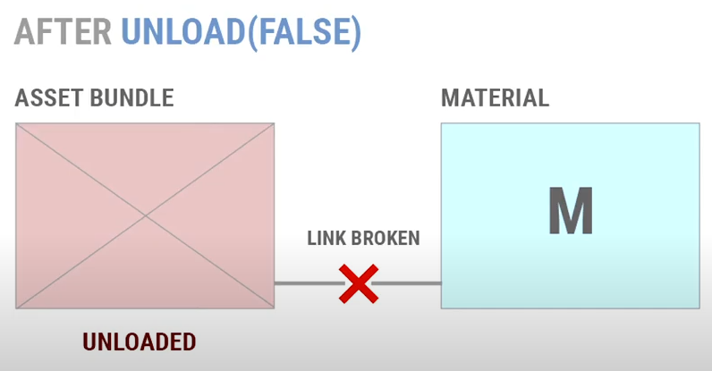
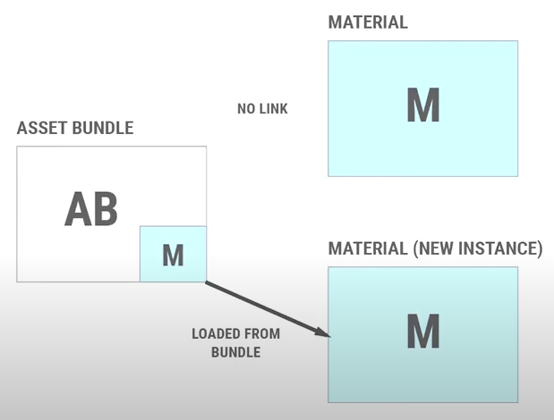

# AssetBundle 사용 시 주의사항

## AssetBundle.Unload()시 메모리 누수 주의

AssetBundle을 사용하다가 메모리 관리와 같은 이유로 로딩된 번들을 해제해야 할 필요가 있다.<br />
그럴 때 사용하는 메서드가 바로 AssetBundle.Unload()이다.
메서드 이름에서부터 알 수 있듯이, 이 메서드는 AssetBundle 위치에 해당되는 번들을 메모리에서 해제시킨다.

```C#
AssetBundle unitDataBundle = AssetBundleLoader.LoadFromMemory(assetbundlePath);
unitDataBundle.Unload(true);
```

위의 예시와 같이 사용한다.
그런데, 이 메서드를 사용할 때 무척 주의해야 할 점이 있다.

```C#
public void Unload(bool unloadAllLoadedObjects);
```

보다시피, AssetBundle.Unload()는 매개변수로 bool형 인자를 하나 받는다.
AssetBundle에서 로드한 에셋들은 자신이 속한 번들과 일종의 링크가 존재하는데,
이 unloadAllLoadedObjects를 true로 주느냐, false로 주느냐에 따라서 메모리 상황에 큰 차이가 발생할 수 있다.



Unload의 인자를 true로 하였을 경우, 번들이 메모리상에서 해제되며, 그와 함께 해당 번들에 링크된 모든 에셋들도 함께 해제된다.




문제는 Unload의 인자를 false로 했을 때 발생한다.
번들은 메모리상에서 해제되지만, 함께 로딩했던 에셋들은 사라지지 않는다.
더욱 큰 문제는, 이후 동일한 번들을 다시 생성했을 때에 발생한다.
이전 번들에서 로딩되었던 에셋들이 새로 불러들여진 번들과 연결되면 참 좋겠지만, 실상은 그렇지 않다.
오히려 해당되는 에셋들은 메모리 상에 중복되어 존재하는 상황이 되어버린다.

그렇기에 Unload의 인자를 false로 하는 상황이 반복되면, 메모리에 심각한 문제를 초래할 수 있다.
하지만, 게임을 설계하다가 필연적으로 Unload(false)를 사용해야 하는 상황이 발생할 수 있다.
그럴 때 사용하는 것이 바로 아래의 메서드이다.

```C#
Resources.UnloadUnusedAssets();
```

메서드 이름을 읽는 것만으로 어떤 기능이 있는 지 알 수 있을 것이다.
해당 메서드는 현재 사용되지 않는 모든 에셋을 메모리에서 지우는 역할을 한다.
물론, Scene을 전환하는 상황에서 내부적으로 UnloadUnusedAssets()가 실행되기는 한다.
하지만, 동일 Scene 내에서 메모리에 부담되는 상황이 온다면 직접 UnloadUnusedAssets()를 실행할 수도 있다.


### AssetBundle.Unload() 예시

아래는 직접 작성한 코드의 일부이다.

```C#
PlayerData playerData = PlayerData.Instance;
string assetbundlePath = "units/unitdata";
string loadJson = File.ReadAllText(path);

saveData = JsonUtility.FromJson<SaveData>(loadJson);
AssetBundle unitDataBundle = AssetBundleLoader.LoadFromMemory(assetbundlePath);

if (saveData != null)
{
    for (int i = 0; i < saveData.organizedUnitInfoData.Count; i++)
    {
        var unitInfoAsset = unitDataBundle.LoadAsset<UIUnitInfo>(saveData.organizedUnitInfoData[i]);
                    
        if (!playerData.OrganizedUnitInfos.Contains(unitInfoAsset))
        {
            var unitInfo = Instantiate(unitInfoAsset);
            playerData.AddUnitToOrganizedUnitList(unitInfo);
        }
    }

    for (int i = 0; i < saveData.possessedUnitInfoData.Count; i++)
    {
        var unitInfoAsset = unitDataBundle.LoadAsset<UIUnitInfo>(saveData.possessedUnitInfoData[i]);
                    
        if (!playerData.PossessedUnitInfos.Contains(unitInfoAsset))
        {
            var unitInfo = Instantiate(unitInfoAsset);
            playerData.AddUnitToPossessedUnitList(unitInfo);
        }
    }
}

/// AssetBundle.Unload(false) -> Resources.UnloadUnusedAssets()
unitDataBundle.Unload(false);
Resources.UnloadUnusedAssets();
return saveData;
```

위의 스크립트는 json으로 간단하게 저장한 유저의 유닛 편성 정보를 읽어와서
다시 게임 플레이 중 필요한 정보를 세팅해주는 내용이다.
번들에서 json에서 읽어온 값에 해당하는 유닛 정보가 저장된 Scriptable Object를 번들로부터 로딩하여 
인게임 도중 작동하는 PlayerData라는 오브젝트에 전달해주는 기능을 수행했다.

AssetBundle 시스템은 동일한 번들을 중복으로 로딩해올 수가 없다.
만약 중복으로 불러오려 한다면 이미 동일한 이름의 번들이 존재한다며 에러가 발생해버린다.
때문에 AssetBundle.Unload() - 예시에서는 unitDataBundle.Unload() - 를 사용하지 않고서는
로딩 버튼을 연속으로 눌렀을 시 그러한 오류가 발생하는 상황이었기 때문에 반드시 Unload()를 사용해야만 했었다.

문제는 이 때, 번들을 사용한 후 해제할 때 Unload의 인자를 true로 전달한다면
전달된 Scriptable Object가 지닌 정보의 일부가 날아가버린다는 것에 있었다.
물론 더 나은 방법이 있었을지도 모르겠지만, 그런 방법이 좀처럼 떠오르지 않았기 때문에 
결국 최대한 사용을 피하려 했던 Unload(false)를 사용하기로 했다.