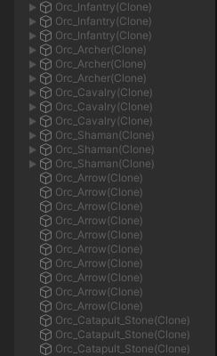
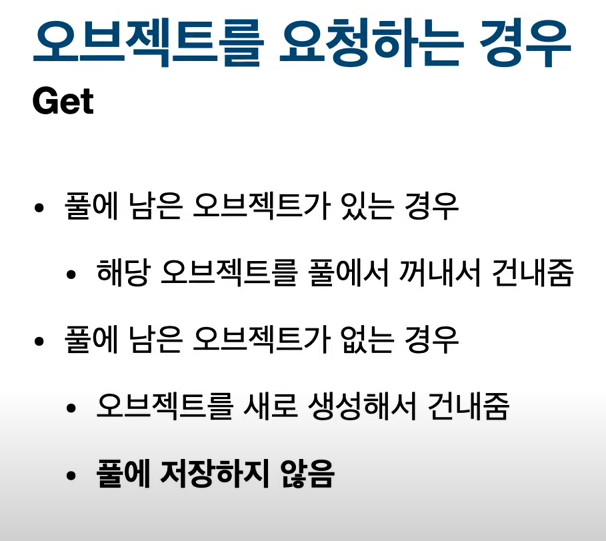
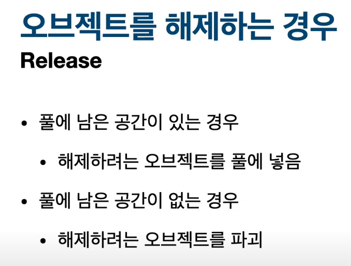
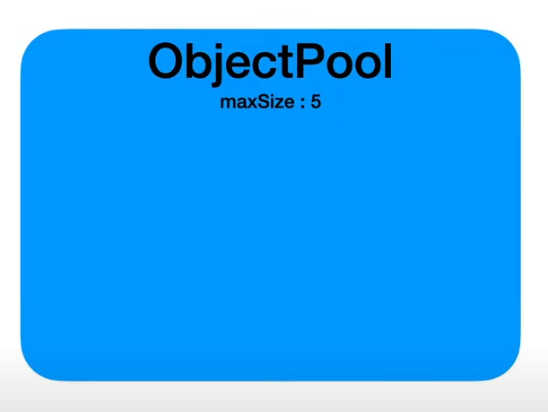
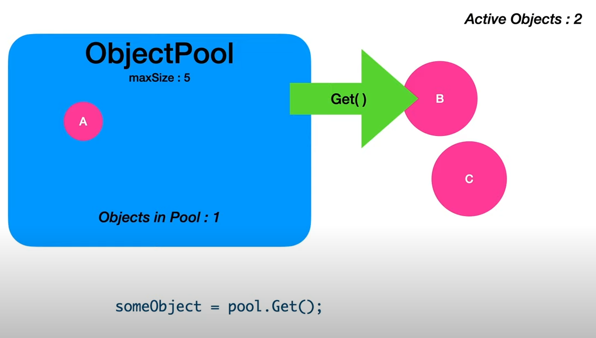
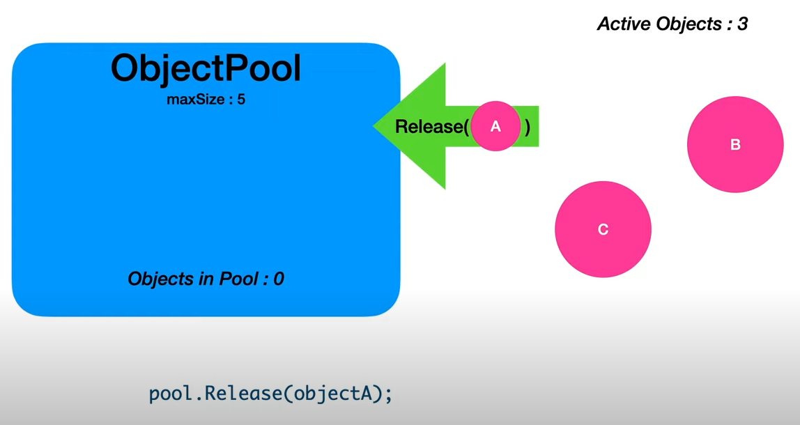
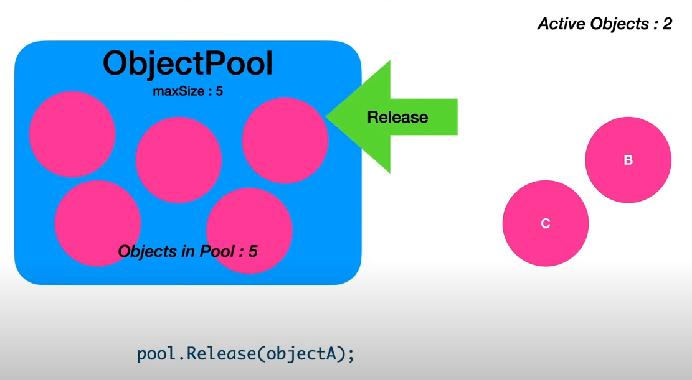

# Object Pooling

**오브젝트 풀링**이라고 불리는 기법은 게임 프로그래밍에 있어서 기초적이면서도 필수적인 기법이다.

유니티에서 오브젝트를 새로 생성하고, 파괴하는 행위는 생각보다 많은 연산을 필요로 한다.<br />
물론 그 수가 많지 않을 경우에는 그래도 컴퓨터가 간단하게 처리해낼 수 있지만,<br />
예를 들어서 탄막 슈팅 게임 등에서 총알 오브젝트를 생성한다고 가정할 경우, 그 수가 상당하기 때문에<br />
여러 오브젝트가 생성되고 파괴된 이후, GC가 작동할 가능성이 매우 높아지며, 이는 필연적인 속도 저하로 이어지게 된다.<br />
게임을 한창 플레이 하는 도중의 프레임 저하는, 게임을 즐기는 사람들이라면 누구나 공감하겠지만<br />
잠깐이라 할지라도 꽤 불쾌한 경험을 안겨다주며, 또 게임 장르에 따라선 실제 플레이에 큰 지장을 주기 때문에<br />
최대한 일어나지 않도록 해야 하는 현상이다.

이러한 현상을 최소화하고자 사용하는 패턴이 바로 오브젝트 풀링이다.<br />
오브젝트 풀링은 미리 여러 개의 오브젝트를 생성해두고, 해당 오브젝트가 필요한 상황에 이를 사용한 다음,<br />
오브젝트가 파괴되야하는 상황에 이를 파괴하는 대신, 다시 저장해두었다가 사용할 수 있도록 만드는 것이다.



위의 예시 사진처럼, 여러 개가 필요할 것 같은 오브젝트를 미리 생성해두고 SetActive를 false로 해둔 다음,<br /> 
필요한 상황에 다시 SetActive를 true로 만들어서 사용한다.

## Object Pooling 구현

오브젝트 풀링은 단지 명칭일 뿐, 이를 실제로 구현하는 방법은 여러 가지가 존재한다.<br />
이 글에서는 그 중 몇 가지 방법을 소개하고자 한다.<br />

### 1. delegate를 이용한 Object Pooling 구현

```C#
using System.Collections;
using System.Collections.Generic;
using UnityEngine;

public class GameObjectPool<T> where T : class
{
    // 객체를 반환해줄 델리게이트
    public delegate T Func();

    Queue<T> objectPool = new Queue<T>();

    int count;
    Func createFunc;

    #region Constructor
    // 오브젝트 풀 생성자
    // count를 통해 큐의 크기를, createFunc을 통해 객체를 받아옴
    public GameObjectPool(int count, Func createFunc)
    {
        this.count = count;
        this.createFunc = createFunc;
        Allocate();
    }
    #endregion

    // 큐에 지정된 객체를 저장(초기화)하는 메서드
    public void Allocate()
    {
        for (int i = 0; i < count; i++)
        {
            objectPool.Enqueue(createFunc());
        }
    }

    // 큐에 저장된 객체를 불러오는 메서드
    // 단, 큐에 저장된 것보다 더 많은 객체가 필요할 경우, 임시로 객체를 생성함
    public T Get()
    {
        if (objectPool.Count > 0)
        {
            return objectPool.Dequeue();
        }
        else
        {
            return createFunc();
        }
    }
    
    // 큐에 지정된 객체를 저장하는 메서드
    public void Set(T obj)
    {
        objectPool.Enqueue(obj);
    }
}
```

GameObjectPool 클래스는 제네릭 지정자를 사용하였다.<br />
T에 풀로 생성하고자 하는 오브젝트에 붙은 스크립트를 지정하면 해당 오브젝트의 풀을 생성할 수 있다.<br />
또한, 내부에 하나의 Queue를 선언해두었는데, 오브젝트 풀은 보통 큐를 이용하여 구현하기 때문이다.<br />
count는 오브젝트 풀의 크기를, createFunc는 오브젝트 풀에 넣을 오브젝트를 반환하는 델리게이트 메서드이다.

작동 방식은 생성자를 통해 매개변수 count와 createFunc를 넘겨주면, <br />
이를 통해 GameObjectPool의 count와 createFunc을 초기화하고,<br />
count의 수만큼 Allocate를 반복 실행하여 createFunc()의 반환값인 오브젝트를 저장하는 것이다.

또한 Get과 Set을 통해 각각 오브젝트 풀에서 오브젝트를 요청 또는 반환할 수 있다.<br />
만약 Get을 통해 얻어올 오브젝트가 풀에 존재하지 않는다면, 새로 생성한다.

이를 실제로 활용하는 코드 예시는 아래와 같다.

```C#
using System.Collections;
using System.Collections.Generic;
using UnityEngine;

public class HeroController : MonoBehaviour
{
    // 총알 제어 변수
    [SerializeField] Transform firePosition;
    [SerializeField] GameObject bulletPrefab;
    GameObjectPool<BulletController> bulletPool;

    // bulletPool에서 총알을 꺼내와 활성화 상태로 만들고 위치를 지정함
    void CreateBullet()
    {
        var bullet = bulletPool.Get();
        bullet.gameObject.SetActive(true);
        bullet.transform.position = firePosition.position;
    }

    // 사용한 총알을 비활성화 시키고 다시 풀에 집어넣음
    public void RemoveBullet(BulletController bullet)
    {
        bullet.gameObject.SetActive(false);
        bulletPool.Set(bullet);
    }

    void Start()
    {
        // 오브젝트 풀에 10개의 총알을 만들어 비활성화 상태로 저장
        // obj에서 총알 프리팹을 인스턴스화하고, 비활성화 상태로 둠
        // bullet에서 총알 객체의 BulletController를 접근할 수 있게 함
        // InitBullet을 통해 생성된 총알 객체의 BulletController에서도 HeroController를 접근할 수 있게 함
        bulletPool = new GameObjectPool<BulletController>(10, () =>
        {
            var obj = Instantiate(bulletPrefab);
            obj.SetActive(false);
            var bullet = obj.GetComponent<BulletController>();
            bullet.InitBullet(this);
            return bullet;
        });

        InvokeRepeating("CreateBullet", 1f, 0.2f);
    }
}
```

HeroController의 Start()에서 오브젝트 풀을 생성하는 모습을 확인할 수 있다.<br />
bulletPrefab에 지정해둔 오브젝트를 생성 및 비활성화 후, 해당 오브젝트의 BulletController 컴포넌트를 반환한다.

CreateBullet()에서는 오브젝트 풀에서 오브젝트를 꺼내와 활성화 시키는 동작을 수행하며,<br />
RemoveBullet()은 반대로 오브젝트를 비활성화 시키고 풀에 집어넣는 동작을 수행한다.

```C#
using System.Collections;
using System.Collections.Generic;
using UnityEngine;

public class BulletController : MonoBehaviour
{
    HeroController hero;

    void Remove()
    {
        hero.RemoveBullet(this);
    }

    public void InitBullet(HeroController hero)
    {
        this.hero = hero;
    }

    void OnEnable()
    {
        if (IsInvoking("Remove"))
        {
            CancelInvoke("Remove");
        }
        Invoke("Remove", 3f);
    }

    void OnTriggerEnter2D(Collider2D collision)
    {
        if (collision.CompareTag("Monster"))
        {
            var mon = collision.gameObject.GetComponent<MonsterController>();
            mon.SetDamage(attack);
            Remove();
        }
    }
}
```

BulletController에서는 오브젝트가 Monster 태그를 지닌 적과 부딪히거나, 활성화 후 3초가 지났을 때,<br />
HeroController의 RemoveBullet()을 호출하여 오브젝트 풀로 되돌아가도록 하고 있다.


### 2. UnityEngine.Pool을 통한 Object Pooling 구현

[retr0 - 유니티 오브젝트 풀링 1/2](https://www.youtube.com/watch?v=v-p0o9KavkI)

[retr0 - 유니티 오브젝트 풀링 2/2](https://www.youtube.com/watch?v=0AFb2hizXVU)

유명한 유니티 입문서인 '레트로의 유니티 게임 프로그래밍 에센스'의 저자이신 retr0 이재민님의 영상에서 배운 내용이다.<br /> 

아무래도 오브젝트 풀링이라는 것이 게임 제작에서 굉장히 많이 사용되는 기법이니만큼,<br /> 
2021 LTS버전부터는 아예 유니티가 UnityEngine.Pool이라는 namespace를 추가하고 기능을 제공하기 시작했다.

UnityEngine.Pool에서 제공하는 오브젝트 풀은 두 가지의 메서드를 사용한다.<br /> 
그것은 바로 **Get**과 **Release**다.<br /> 
Get은 오브젝트 풀에서부터 오브젝트를 가져오는 것, 즉 요청하는 것이고,<br /> 
Release는 오브젝트 풀로 오브젝트를 반환하는 것, 즉 해제하는 것이다.



Get은 풀에 오브젝트가 없을 경우, 해당 오브젝트를 새로 생성하여 건네준다.<br /> 
풀에 남은 오브젝트가 존재한다면, 당연히 풀에 남아있는 오브젝트를 건네준다.



Release는 풀에 남아 있는 공간이 있을 경우, 풀에 오브젝트를 집어넣지만,<br /> 
만약 남은 공간이 없다면, 해제하려는 오브젝트를 그대로 파괴한다.



UnityEngine.Pool의 오브젝트 풀은 처음 생성 시 최대 크기를 지정하도록 되어 있다.<br /> 
위의 그림과 같이 최대 5개의 오브젝트를 보관할 수 있는 풀을 생성헀다고 가정해보자.<br /> 
이 때, 지금 풀은 비어있는 상태이므로 Get()을 호출 시, 오브젝트를 새로 생성하여 건네준다.



위의 그림처럼 남아있는 오브젝트가 있다면, Get() 호출 시 당연히 이미 존재하는 오브젝트를 건네준다.



Release()의 경우도 비슷한데, 풀에 남아있는 공간이 있는 상태에서 Release()를 호출 시,<br /> 
당연히 오브젝트는 풀 안으로 들어가게 된다.



그러나 풀에 공간이 없을 경우, Release() 호출 시 해당 오브젝트들은 파괴된다.<br /> 
위의 그림같은 경우, 오브젝트 B와 C는 풀에 자리가 없으므로 파괴되는 것이다.

그러면 이제 UnityEngine.Pool을 사용하여 실제로 오브젝트 풀링을 구현한 코드를 보도록 하자.<br /> 
우선 이재민님의 영상에서 나오는 UnityEngine.Pool을 활용한 예제 코드는 아래와 같다.<br />
영상 2편 설명란에 샘플 프로젝트를 다운받을 수 있는 링크가 올라와 있으니 직접 프로젝트를 열어보는 것도 좋다.

```C#
using UnityEngine;
using UnityEngine.Pool;

public class HatCreator : MonoBehaviour
{
    ObjectPool<Hat> _hatPool;
    public Hat hatPrefab;

    void Start()
    {
        _hatPool = new ObjectPool<Hat>(
                    createFunc: () => 
                    {
                        var createdHat = Instantiate(hatPrefab);
                        createdHat.poolToReturn = _hatPool;
                        return createdHat;
                    },
                    actionOnGet: (hat) => 
                    {
                        hat.gameObject.SetActive(true);
                        hat.Reset();
                    },
                    actionOnRelease: (hat) => 
                    {
                        hat.gameObject.SetActive(false);
                    },
                    actionOnDestroy: (hat) => 
                    {
                        Destroy(hat.gameObject);
                    },
                    maxSize: 30);
    }

    void Update()
    {
        if (Input.GetMouseButtonDown(0))
        {
            var count = Random.Range(1, 10);
            for (int i = 0; i < count; i++)
            {
                CreateHat();
            }
        }
    }

    void CreateHat()
    {
        var position = Random.insideUnitSphere + new Vector3(0, 3, 0);
        var rotation = Random.rotation;

        var hat = _hatPool.Get();
        hat.transform.position = position;
        hat.transform.rotation = rotation;
    }
}
```

위의 코드는 오브젝트 풀을 구현하는 코드이다.<br />
UnityEngine.Pool에서 제공하는 오브젝트 풀을 생성하기 위해서는 5가지 매개변수를 넘겨줘야 한다.<br />
그것이 바로 위의 Start에서 볼 수 있는 createFunc, actionOnGet, actionOnRelease, actionOnDestroy, maxSize이다.

**createFunc**는 오브젝트 풀에 오브젝트가 없을 시 생성할 오브젝트를 반환하도록 하면 된다.<br />
**actionOnGet**은 풀에서 Get()을 호출 시 동작하며, **actionOnRelease**는 반대로 Release()를 호출 시 동작하는 내용이다.<br />
**actionOnDestroy**는 풀에 자리가 없을 경우의 오브젝트에 대한 처리라고 볼 수 있다.<br />
**maxSize**는 해당 오브젝트 풀의 사이즈를 지정하는 것이다. 위의 예제에서는 30개의 오브젝트를 담도록 만들어졌다.

CreateHat 메서드는 오브젝트 풀에서 생성되는 hat 오브젝트의 position과 rotation을 지정하고,<br />
오브젝트 풀의 Get()을 통해 오브젝트를 생성하거나, 또는 풀에서 가져오는 동작을 수행한다.

```C#
using System.Collections;
using UnityEngine;
using UnityEngine.Pool;

public class Hat : MonoBehaviour
{
    public IObjectPool<Hat> poolToReturn;
    public bool IsTriggered { get; private set; }

    public void Reset()
    {
        IsTriggered = false;
    }

    void OnCollisionEnter(Collision other)
    {
        if (IsTriggered)
        {
            return;
        }

        if (other.collider.CompareTag("Ground"))
        {
            IsTriggered = true;
            StartCoroutine(DestroyHat);
        }
    }

    IEnumerator DestroyHat()
    {
        yield return new WaitForSecond(3f);
        poolToReturn.Release(this);
    }
}
```

위의 Hat 클래스는 오브젝트 풀에서 꺼내지는 오브젝트 hat에 부착된 스크립트의 클래스이다.<br />
단순한 기능을 수행하는데, 여기서 눈여겨봐야 할 점은 IObjectPool형 변수인 poolToReturn이다.<br />
해당 오브젝트는 OnCollisionEnter와 DestroyHat 코루틴에서 볼 수 있듯이,<br />
땅에 닿을 경우, 3초 후에 풀로 돌아가는 동작을 수행하는데, 이를 위해 poolToReturn을 선언하고,<br />
HatCreator에서 오브젝트 풀을 선언할 때 createFunc에서 해당 풀을 지정해주도록 하는 것이다.<br />
이를 통해 hat 오브젝트들은 생성될 시 돌아가야 할 풀을 기억하고 있을 수 있다.


### 3. 매니저 클래스를 통한 다중 Object Pooling 구현

[Brackeys - OBJECT POOLING in Unity!](https://www.youtube.com/watch?v=tdSmKaJvCoA)

이 내용은 Brackeys라는 유명 유니티 크리에이터 채널에서 배운 내용이다.<br />
Brackeys 채널은 비록 새로운 영상이 올라오지 않은 지는 좀 되었지만, <br />
지금까지도 유용한 유니티 게임 제작의 기초 지식들이 많기 때문에 한번쯤 참고해보면 큰 도움이 된다.

위의 영상에서는 하나의 Singleton 오브젝트, 즉 매니저급의 클래스를 통해<br />
여러 개의 오브젝트 풀을 생성하고 관리하는 방법에 대해서 설명하고 있다.

우선 곧바로 예시 코드를 살펴보자.

```C#
using System.Collections.Generic;
using UnityEngine;

public class ObjectPooler : MonoBehaviour
{
    [System.Serializable]
    public class Pool
    {
        public string tag;
        public GameObject prefab;
        public int size;
    }

    public List<Pool> pools;
    public Dictionary<string, Queue<GameObject>> poolDictionary;

    public GameObject SpawnFromPool(string tag, Vector3 position, Quaternion rotation)
    {
        if (!poolDictionary.ContainsKey(tag))
        {
            return;
        }

        GameObject objectToSpawn = poolDictionary[tag].Dequeue();
        objectToSpawn.SetActive(true);
        objectToSpawn.transform.position = position;
        objectToSpawn.transform.rotation = rotation;

        IPooledObject pooledObj = objectToSpawn.GetComponent<IPooledObject>();
        if (pooledObj != null)
        {
            pooledObj.OnObjectSpawn();
        }

        poolDictionary[tag].Enqueue(objectToSpawn);
        return objectToSpawn;
    }

    #region Singleton
    public static ObjectPooler Instance;
    void Awake()
    {
        if (Instance != null)
        {
            Destroy(this;)
        }
        Instance = this;
    }
    #endregion

    void Start()
    {
        poolDictionary = new Dictionary<string, Queue<GameObject>>();

        foreach(Pool pool in pools)
        {
            Queue<GameObject> objectPool = new Queue<GameObject>();
            for (int i = 0; i < pool.size; i++)
            {
                GameObject obj = Instantiate(pool.prefab);
                obj.SetActive(false);
                objectPool.Enqueue(obj);
            }
            poolDictionary.Add(pool.tag, objectPool);
        }
    }
}
```

이 클래스는 Dictionary와 List를 통해 여러 개의 오브젝트 풀을 동시에 사용할 수 있도록 해준다.<br />
우선, System.Serializable 속성이 붙은 Pool 클래스가 있다.<br />
이는 유니티 에디터 상에서 Pool 클래스의 public 또는 serialized 속성이 붙은 멤버에 접근할 수 있도록 해준다.<br />
이를 통해 에디터 상에서 Pool형을 담을 수 있는 List인 pools에 오브젝트 풀로 만들 오브젝트들을 설정해주면 된다.<br />
풀에 담을 오브젝트의 프리팹, 그리고 오브젝트를 불러올 때 쓸 태그와 풀의 사이즈를 지정해준다.<br />
태그는 Dictionary로부터 그에 해당하는 오브젝트 풀을 찾아야 하기 때문에 설정하는 것이다.

이렇게 설정하고 에디터를 플레이모드로 실행하면, poolDictionary가 초기화 된 후,<br />
pools List에 있는 Pool 클래스의 수만큼 Queue가 생성되고, <br />
해당 Queue에 Pool의 size만큼 Pool에 지정해둔 prefab을 담는다.<br />
그리고 poolDictionary로부터 해당 풀을 찾을 수 있도록, Pool 클래스의 tag와 오브젝트 풀을 한 쌍으로 묶어 추가한다.

SpawnFromPool은 Dictionary로부터 오브젝트 풀을 찾고, 그로부터 오브젝트를 꺼내오는 메서드이다.<br />
우선 매개변수로 문자열, Vector3, Quaternion을 받는다.<br />
문자열을 받는 이유는 태그 이름을 찾아 해당하는 오브젝트 풀을 찾기 위함이다.<br />
Vector3와 Quaternion은 꺼낸 오브젝트의 position과 rotation을 설정하기 위한 매개변수이다.

이 예제에서 오브젝트 풀에 들어갈 오브젝트들은 모두 IPooledObject 인터페이스를 상속받는다.<br />
IPooledObject는 아래와 같이 OnObjectSpawn() 하나만을 구현하면 되는 단순한 인터페이스이다.

```C#
public interface IPooledObject
{
    void OnObjectSpawn();
}
```

Dictionary에서 tag에 해당하는 풀이 있음을 확인하면,<br />
해당 풀에서 오브젝트를 하나 Dequeue로 꺼내온 후 활성화하고, position과 rotation을 지정해준다.<br />
그 다음, 생성된 각 오브젝트에서 따로 수행해야 할 일이 있다면, <br />
이는 IPooledObject를 구현하는 OnObjectSpawn()에서 실행하도록 한다.

마지막으로, 이 예제에서는 큐에서 꺼낸 오브젝트에서 OnObjectSpawn()을 실행하고 바로 다시 큐에 집어넣도록 하고 있다.<br />
즉, 오브젝트는 작동 중이지만, 그와 동시에 큐로 바로 다시 들어와 있는 상태인 것이다.

이 예제의 경우, 여러 개의 오브젝트 풀을 한번에 에디터를 통해 설정할 수 있다는 점에서는 매우 편리했지만,<br />
위의 두 예제와는 다르게 오브젝트의 개수가 유동적이지 않았다. 즉, 풀이 지정한 개수 이상으로 생성이 불가능하다.<br />
물론 이 점은 사용하는 사람에 따라서 코드를 약간만 본인의 용도에 맞게 수정하면 쉽게 해결되는 문제이다.