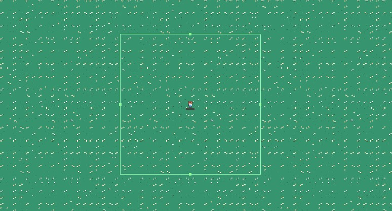

# 언데드 서바이버


처음으로 완성한 유니티 프로젝트인 '언데드 서바이버'에 대한 정리를 해둔 글이다.<br />
첫 프로젝트를 진행하면서 되새겨둘 내용이나 여러 느낀 점을 정리해보고자 한다.<br />
제작 기간은 2022년 11월 23일부터 2022년 12월 23일이다.<br />

흔히들 '뱀서류'라 부르는 뱀파이어 서바이버, 매직 서바이버를 원류로 하는 서바이벌 스타일의 게임이다.<br />
사용 에셋은 유니티 에반젤리스트이자 유튜버로 활동중이신 '골드메탈'님이 무료로 배포하는 에셋을 주로 사용했다.<br />
그 밖에 유니티 에셋스토어의 무료 배경음 에셋, 그리고 '마왕혼'이라는 일본 웹사이트의 무료 효과음을 사용하기도 했다.


## 게임 기본 구성

프리팹 생성이나 기본적인 2D 애니메이션과 같은 내용은 생략하려고 한다.


### Loading Scene

'언데드 서바이버'는 기본적으로 타이틀, 로딩, 게임의 3개의 Scene으로 구성되어 있다.<br />
타이틀에서는 게임에 대한 기본 설명과, 사운드 조절이 가능한 설정창을 이용할 수 있으며,<br />
UI가 아닌 다른 부분을 탭할 경우 자동으로 로딩 Scene을 거쳐 게임화면으로 넘어가게 된다.

유니티에서 다른 Scene을 로딩하면 기존 Scene에서 더 이상 사용하지 않는 모든 메모리를 정리하게 되는데,<br />
이 때, 예를 들어서 Scene A와 B가 있다고 가정하면, 아래와 같은 방식으로 메모리 정리가 이루어진다.<br />
`Scene A 사용 중 -> Scene B 로딩 -> Scene B에서 필요한 모든 오브젝트 준비 -> Scene B로 전환 후 Scene A의 메모리 정리`
그러나, 만약 Scene A와 B에서 사용하는 메모리의 양이 너무 크다면, <br />
특히 모바일 환경에서는 메모리 사용량을 초과하여 앱 사용에 매우 좋지 못한 영향을 끼칠 우려가 있다.

그렇기 때문에, 로딩을 위한 Scene을 별도로 사용하여 일종의 완충 구간을 만드는 것이다.<br />
로딩 중 유저에게 보여줄 간단한 내용만을 담은 Scene으로 우선 전환하고, 그 다음 원래 불러오려던 Scene을 불러오게 되면<br />
이미 다량의 메모리를 사용하는 도중에 다시 큰 메모리를 사용하지 않게 되므로 안정적으로 Scene을 전환할 수 있다.<br />
물론 이 게임은 애초에 용량이 작기 때문에, 로딩용 Scene이 존재하지 않아도 별 무리는 없지만<br />
그럼에도 일종의 예행연습 개념으로 Load Scene을 구현해보았다.

```c#
using System.Collections;
using UnityEngine;
using UnityEngine.SceneManagement;

/// <summary>
/// LoadScene에서 Scene 로딩을 담당하는 LoadSceneManager 스크립트.
/// </summary>

public class LoadSceneManager : MonoBehaviour
{
    #region Field
    [SerializeField] LoadingBar loadingBar;
    [SerializeField] TipText tipText;
    AsyncOperation operation;

    public static int nextScene;
    #endregion

    #region Unity Event
    void Start()
    {
        tipText.SetTipText();
        StartCoroutine(LoadSceneAsync());
    }
    #endregion

    #region Method
    /// <summary>
    /// Scene을 전환하는 처리를 담당.<br/>
    /// 로딩용 Scene을 호출하고, 다시 매개변수에 해당하는 Scene으로 이동함.
    /// </summary>
    /// <param name="sceneState"></param>
    public static void LoadScene(SceneState sceneState)
    {
        nextScene = (int)sceneState;

        // Build Setting의 LoadScene의 인덱스가 0
        SceneManager.LoadScene((int)SceneState.Load);
    }

    IEnumerator LoadSceneAsync()
    {
        operation = SceneManager.LoadSceneAsync(nextScene);
        /// allowSceneActivation을 false로 하여 Scene 로딩을 90퍼센트 수준에서 멈추도록 함
        /// allowSceneActivation이 true로 변경될 시에만 나머지 로딩을 끝마치게 됨
        operation.allowSceneActivation = false;

        float timer = 0.0f;
        while (!operation.isDone)
        {
            yield return null;

            /// 로딩 진행 상황이 90퍼센트에 도달할 때까지는 로딩을 그대로 진행
            if (operation.progress < 0.9f)
            {
                loadingBar.Slider.value = operation.progress;
            }

            /// 로딩 진행 상황이 90퍼센트에 도달했을 경우,
            /// 일부러 짧은 페이크 로딩 시간을 발생시켜 대기하게 함
            else
            {
                timer += Time.unscaledDeltaTime;
                loadingBar.Slider.value = Mathf.Lerp(0.9f, 1f, timer);

                /// 페이크 로딩 시간도 지나 로딩바가 전부 찼을 경우,
                /// allowSceneActivation을 true로 전환하여 Scene을 완전히 전환시키고 코루틴 종료
                if (loadingBar.Slider.value >= 1f)
                {
                    operation.allowSceneActivation = true;
                    yield break;
                }
            }
        }
    }
    #endregion
}
```

위의 코드는 '베르의 프로그래밍 노트' 블로그를 참고한 내용이다.<br />
[베르의 프로그래밍 노트 - LoadScene Manager](https://wergia.tistory.com/183) 


### 오브젝트 풀링 (Object Pooling)

뱀서류 게임은 기본적으로 한 명의 플레이어가 다수의 몬스터를 상대하는 게임이기 때문에,<br />
다수의 게임 오브젝트를 효율적으로 불러오는 것이 무엇보다도 중요했다.<br />
이럴 때 사용하는 가장 좋은 기법은 오브젝트 풀링이기 때문에, 당연히 사용했다.

이전에 정리해둔 오브젝트 풀링 기법을 사용했으며, <br />
이 오브젝트 풀러는 싱글턴이기 때문에 게임 Scene에서는 필요에 따라 마음껏 오브젝트를 불러서 사용할 수 있는 구조이다.<br />
[Object Pooling 정리글](../ObjectPooling_1.md)

```c#
using System.Collections.Generic;
using UnityEngine;

/// <summary>
/// 여러 게임 오브젝트를 각각의 Pool을 생성하여 관리하는 Object Pooler 클래스.<br/>
/// Queue를 이용해 만들어진 Pool들을 Dictionary를 통해 관리함.
/// </summary>

public class ObjectPooler : MonoBehaviour
{
    /// 각각의 Object Pool을 생성할 때 사용할 Pool 클래스
    /// 프리팹, 태그, Pool의 크기에 대한 정보를 저장
    [System.Serializable]
    private class Pool
    {
        public GameObject objectPrefab;
        public string tag;
        public int size;
    }

    #region Field
    /// Pool 클래스를 모아서 ObjectPooler의 초기화에 사용할 List
    /// 에디터에서 List의 크기를 지정하고 각 Pool 클래스의 값을 초기화함
    [SerializeField] List<Pool> pools;

    /// Pool 전체를 관리하는 poolDictionary
    Dictionary<string, Queue<GameObject>> poolDictionary;

    /// 오브젝트 풀의 용량이 부족할 경우 추가적으로 오브젝트를 생성할 때
    /// 태그를 통해 Pool 클래스에서 오브젝트의 정보를 얻어오기 위한 poolIndex
    Dictionary<string, Pool> poolIndex;
    #endregion

    #region Method
    /// <summary>
    /// 오브젝트를 꺼내지는 않되, 오브젝트의 정보를 확인할 CheckFromPool 메서드.
    /// 태그를 이용해 해당되는 오브젝트를 반환함.
    /// </summary>
    /// <param name="tag"></param>
    /// <returns></returns>
    public GameObject CheckFromPool (string tag)
    {
        if (!poolIndex.ContainsKey(tag))
            return null;

        GameObject objectToCheck = poolIndex[tag].objectPrefab;

        return objectToCheck;
    }

    /// <summary>
    /// Dictionary로부터 오브젝트를 얻어올 SpawnFromPool 메서드.
    /// 태그를 이용해 꺼내올 오브젝트에 해당하는 pool을 찾고, 해당 오브젝트의 OnObjectSpawn 메서드를 실행함.
    /// </summary>
    /// <param name="tag"></param>
    /// <param name="position"></param>
    /// <param name="rotation"></param>
    /// <returns></returns>
    public GameObject SpawnFromPool (string tag, Vector3 position, Quaternion rotation)
    {
        if (!poolDictionary.ContainsKey(tag))
            return null;

        if (poolDictionary[tag].Count > 0)
        {
            GameObject objectToSpawn = poolDictionary[tag].Dequeue();
            objectToSpawn.SetActive(true);
            objectToSpawn.transform.position = position;
            objectToSpawn.transform.rotation = rotation;

            IPooledObject pooledObj = objectToSpawn.GetComponent<IPooledObject>();
            if (pooledObj != null)
                pooledObj.OnObjectSpawn();

            return objectToSpawn;
        }
        else
        {
            GameObject newObject = Instantiate(poolIndex[tag].objectPrefab);
            newObject.SetActive(true);
            newObject.transform.position = position;
            newObject.transform.rotation = rotation;

            IPooledObject pooledObj = newObject.GetComponent<IPooledObject>();
            if (pooledObj != null)
                pooledObj.OnObjectSpawn();

            return newObject;
        }
    }

    /// <summary>
    /// 사용한 오브젝트를 다시 Dictionary로 집어넣을 InsertToPool 메서드.
    /// 태그를 이용해 돌아갈 pool을 찾고, 해당 pool에 오브젝트를 비활성화시켜 집어넣음.
    /// </summary>
    /// <param name="tag"></param>
    /// <param name="obj"></param>
    public void InsertToPool(string tag, GameObject obj)
    {
        IPooledObject objectToInsert = obj.GetComponent<IPooledObject>();
        objectToInsert.OnObjectInsert();

        obj.SetActive(false);
        poolDictionary[tag].Enqueue(obj);
    }
    #endregion

    #region Singleton
    public static ObjectPooler Instance;

    void Awake()
    {
        if (Instance != null)
            Destroy(this);

        Instance = this;    
    }
    #endregion

    #region Unity Event
    void Start()
    {
        poolDictionary = new Dictionary<string, Queue<GameObject>>();

        poolIndex = new Dictionary<string, Pool>();

        /// pools List에 담긴 각 오브젝트들을 오브젝트 풀을 생성하여 집어넣음
        /// 그리고 해당 오브젝트 풀을 다시 poolDictionary에 집어넣음
        foreach (Pool pool in pools)
        {
            Queue<GameObject> objectPool = new Queue<GameObject>();

            for (int i = 0; i < pool.size; i++)
            {
                GameObject obj = Instantiate(pool.objectPrefab);
                obj.SetActive(false);
                objectPool.Enqueue(obj);
            }
            poolDictionary.Add(pool.tag, objectPool);
            poolIndex.Add(pool.tag, pool);
        }
    }
    #endregion
}
```

코드상에서는 위와 같으며, 이를 빈 게임 오브젝트에 컴포넌트로 부착하고서 아래와 같이 사용할 수 있다.<br />
Pool 클래스의 멤버대로 풀에 등록할 오브젝트의 태그를 임의로 설정하고, <br />
초기에 미리 생성해 둘 개수와 프리팹을 등록한다.<br />
만약 런타임 도중 설정해 둔 개수 이상으로 오브젝트가 필요해지면, 그 때는 추가적으로 Instantiate를 하게 된다.


위와 같이 설정된 오브젝트 풀러를 동일한 Scene에서 필요한 경우에 사용하면 된다.<br />
예를 들어서, 이 게임에서는 Object Spawner 오브젝트를 제작하여 아이템이나 몬스터 같이<br />
다수가 존재하면서 일정 시간마다 계속해서 생성되어야 하는 오브젝트들을 생성하도록 했다.<br />
Object Spawner의 코드 중 Object Pooler를 호출하는 부분은 아래와 같다.

```c#
using UnityEngine;

public class ObjectSpawner : GameEventListener
{
    // ...
    #region Method
    public void SpawnMonster()
    {
        float spawnPositionX = Random.Range(mapBorderUpLeft.runtimeValue.x, mapBorderDownRight.runtimeValue.x);
        float spawnPositionY = Random.Range(mapBorderDownRight.runtimeValue.y, mapBorderUpLeft.runtimeValue.y);
        Vector3 spawnPosition = new Vector3(spawnPositionX, spawnPositionY, 0);

        string monsterTag = monsterTags[Random.Range(0, monsterTags.Length)].runtimeValue;

        ObjectPooler.Instance.SpawnFromPool(monsterTag, spawnPosition, Quaternion.identity);
        currentMonsterNumber.runtimeValue++;
    }

    public void SpawnItem()
    {
        float spawnPositionX = Random.Range(mapBorderUpLeft.runtimeValue.x, mapBorderDownRight.runtimeValue.x);
        float spawnPositionY = Random.Range(mapBorderDownRight.runtimeValue.y, mapBorderUpLeft.runtimeValue.y);
        Vector3 spawnPosition = new Vector3(spawnPositionX, spawnPositionY, 0);

        string itemTag = itemTags[Random.Range(0, itemTags.Length)].runtimeValue;

        // itemTags[0] == HealthPack
        if (itemTag == itemTags[0].runtimeValue &&
            maximumHealthPackNumber.runtimeValue > currentHealthPackNumber.runtimeValue)
        {
            ObjectPooler.Instance.SpawnFromPool(itemTag, spawnPosition, Quaternion.identity);
        }

        // itemTags[1] == Magnet
        else if (itemTag == itemTags[1].runtimeValue &&
            maximumMagnetNumber.runtimeValue > currentMagnetNumber.runtimeValue) 
        {
            ObjectPooler.Instance.SpawnFromPool(itemTag, spawnPosition, Quaternion.identity);
        }

        // itemTags[2] == RootBox
        else if (itemTag == itemTags[2].runtimeValue &&
            maximumRootBoxNumber.runtimeValue > currentMagnetNumber.runtimeValue)
        {
            ObjectPooler.Instance.SpawnFromPool(itemTag, spawnPosition, Quaternion.identity);
        }
    }

    // ...
    #endregion
}
```


### 스크립터블 오브젝트 (Scriptable Object) 적극 활용

스크립터블 오브젝트는 유니티에서 제공하는 일종의 커스텀 데이터 컨테이너라고 한다.<br />
스크립터블 오브젝트는 컴포넌트로 부착될 수 있는 MonoBehaviour를 상속받는 일반적인 스크립트들과는 다르게,<br />
ScriptableObject를 상속받으며, Scene상에서 존재할 수 없고 대신 프로젝트 상에서 Asset의 형태로 존재한다.

일반적으로는 단순히 다수의 오브젝트가 공통으로 사용하며 런타임 도중 변할 일이 없는 값을 저장하는 데에 유용하다.<br />
스크립터블 오브젝트의 값은 에디터 모드냐, 플레이 모드냐에 관계 없이 변경된 값이 계속 저장되기 때문에<br />
유동적인 값을 담는 데에는 주의가 필요하기 때문이다. (물론 아래 설명과 같이 상황에 따라 충분히 가능하긴 하다.)<br />
예를 들자면, 몬스터의 최대 체력과 같은 것은 동일한 종류의 몬스터가 모두 공유할 가능성이 높으니<br />
개별 몬스터가 최대 체력 변수를 선언하는 것 보다는 하나의 스크립터블 오브젝트에서 설정할 경우 <br />
메모리 사용량이 많이 줄어든다.

단순히 이렇게만 사용해도 유용하지만, 스크립터블 오브젝트를 보다 더 적극적으로 활용하기도 한다.<br />
[스크립터블 오브젝트로 게임을 설계하는 3가지 방법](https://unity.com/kr/how-to/architect-game-code-scriptable-objects)

위 링크는 유니티 공식 블로그에서 제공하는 스크립터블 오브젝트의 활용 가이드이다.<br />
스크립터블 오브젝트는 에셋의 형태로 존재하고, Scene에 관계없이 프로젝트 상에서 존재한다.<br />
그러한 점을 이용하여, 스크립터블 오브젝트를 보다 더 적극적으로 활용하는 방법에 대해서 소개하고 있고,<br />
이 점이 무척 흥미롭게 느껴져서 이번 프로젝트에 이 방법을 적용해보기로 했었다.

```c#
using System;
using UnityEngine;

[CreateAssetMenu(fileName = "Vector3", menuName = "Scriptable Objects/Variables/Vector3", order = 9)]
public class Vector3Variable : ScriptableObject
{
    [SerializeField] Vector3 initialValue;
    [NonSerialized] public Vector3 runtimeValue;

    public void OnAfterDeserialize()
    {
        runtimeValue = initialValue;
    }

    public void OnBeforeSerialize() { }

    public void ResetValue()
    {
        runtimeValue = initialValue;
    }
}
```

우선 처음으로 설명된 '변수 설계' 부분이다.<br />
글에서 설명하는 것과 마찬가지로, 예를 들어서 Vector3형 변수가 필요하다고 가정할 경우,<br />
해당 스크립터블 오브젝트 에셋을 생성하여 대신 사용할 수 있다.

이렇게 생성된 에셋을 이용하여 스크립트 상에서의 다른 오브젝트 참조를 줄이고, <br />
대신 에셋에 대한 참조로 변환할 수 있었다.<br />
예를 들어, 이 게임에서는 몬스터가 플레이어를 계속해서 쫓아다니게 하기 위해서 플레이어의 위치를 알 필요가 있는데,<br />
이 때 몬스터가 플레이어의 위치값을 담은 스크립터블 오브젝트를 멤버로 가지면<br />
런타임 도중에도 스크립터블 오브젝트의 값은 실시간으로 반영되므로 플레이어를 직접 참조할 필요가 없어진다.<br />

아래 코드는 playerPosition이라는 Vector3 값을 담은 스크립터블 오브젝트를 몬스터 스크립트에서 활용하는 예시이다.

```c#
using UnityEngine;
using UnityEngine.Jobs;
using Unity.Jobs;
using Unity.Burst;
using System.Collections;

public class Monster : MonoBehaviour, IPooledObject
{
    /// ...
    [Header("Monster Setting")]
    [SerializeField] Vector3Variable playerPosition;

    #region Job
    PositionUpdateJob positionUpdateJob;
    JobHandle positionUpdateJobHandle;
    TransformAccessArray transformAccessArray;

    [BurstCompile]
    struct PositionUpdateJob : IJobParallelForTransform
    {
        public Vector3 direction;
        public float speed;
        public bool isDead;
        public float jobDeltaTime;

        public void Execute(int index, TransformAccess transform)
        {
            if (!isDead)
                transform.position += jobDeltaTime * speed * direction;
        }
    }
    #endregion

    /// ...

    void OnEnable()
    {
        transformAccessArray = new TransformAccessArray(1);
        transformAccessArray.Add(transform);
    }

    void FixedUpdate()
    {
        direction = (playerPosition.runtimeValue - transform.position).normalized;
        if (direction.x < 0)
            spriteRenderer.flipX = true;
        else
            spriteRenderer.flipX = false;

        positionUpdateJob = new PositionUpdateJob()
        {
            direction = direction,
            speed = speed.runtimeValue,
            isDead = isDead,
            jobDeltaTime = Time.fixedDeltaTime
        };

        positionUpdateJobHandle = positionUpdateJob.Schedule(transformAccessArray);
    }
    #endregion

    /// ...
}
```


```c#
using System.Collections.Generic;
using UnityEngine;

[CreateAssetMenu(fileName = "Event", menuName = "Scriptable Objects/Event", order = 0)]
public class GameEvent : ScriptableObject
{
    List<GameEventListener> listeners = new List<GameEventListener>();

    public void Raise()
    {
        for (int i = 0; i < listeners.Count; i++)
        {
            listeners[i].OnEventRaised();
        }
    }

    public void RegisterListener(GameEventListener listener)
    {
        listeners.Add(listener);
    }

    public void UnregisterListener(GameEventListener listener)
    {
        listeners.Remove(listener); 
    }
}
```

그 다음은 스크립터블 오브젝트를 활용한 이벤트 시스템이다.<br />
위와 같이, 스크립터블 오브젝트를 상속받는 이벤트 에셋을 만들고, 이벤트 발생을 선언할 오브젝트에 멤버로 선언한다.<br />
이벤트 발생의 조건이 충족되면, 해당 오브젝트에서 이벤트 발생을 선언한다.

이에 반응할 다른 오브젝트들의 스크립트는 아래의 GameEventListener를 상속하도록 한다.<br />
해당 GameEventListener의 Event에는 구독할 GameEvent를 등록해주면 된다. (이벤트 선언자와 동일한 스크립터블 오브젝트)<br />
그리고 반응할 때의 동작을 함수로 선언하고 Response.AddListener로 해당 함수를 등록해주면 된다.<br />
UnityEvent는 유니티에서 제공하는 이벤트 시스템인데, 이를 활용하는 것이다.

```c#
using UnityEngine;
using UnityEngine.Events;

/// <summary>
/// GameEvent에 반응할 오브젝트의 스크립트가 상속하는 GameEventListener.
/// </summary>
public class GameEventListener : MonoBehaviour
{
    [Tooltip("Event To Subscribe")]
    public GameEvent Event;

    [Tooltip("UnityEvent Subscribe to GameEvent")]
    public UnityEvent Response;

    protected void OnEnable()
    { 
        Event.RegisterListener(this);
    }

    protected void OnDisable()
    { 
        Event.UnregisterListener(this); 
    }

    public void OnEventRaised()
    {
        Response.Invoke();
    }
}
```

아래는 이 이벤트 시스템을 활용한 예시이다.<br />
플레이어가 경험치를 획득하여 레벨업을 하면, 효과음이 발생하도록 해두었다.<br />
GameEvent OnPlayerLevelUp이 바로 스크립터블 오브젝트로 설계된 이벤트이다.

```c#
using UnityEngine;
using UnityEngine.InputSystem;

public class Player : MonoBehaviour
{
    #region Fields
    // ...
    [Header("Player Event")]
    [SerializeField] GameEvent OnPlayerLevelUp;
    #endregion

    #region Unity Event
    void OnTriggerStay2D(Collider2D collision)
    {
        if (collision.gameObject.CompareTag("Item"))
        {
            GetItem(collision.gameObject.gameObject.GetComponent<ICollectable>());
        }
    }
    #endregion

    #region Method
    void GetItem(ICollectable item)
    {
        item.Get();

        if (playerExp.runtimeValue >= playerMaximumExp.runtimeValue)
        {
            PlayerLevelUp();
        }
    }
    void PlayerLevelUp()
    {
        // ...
        OnPlayerLevelUp.Raise();
        GameSceneUI.Instance.OpenSkillSelect();

        playerHp.runtimeValue = playerMaximumHp.runtimeValue;
        playerExp.runtimeValue = 0f;
    }
    #endregion

    // ...
}
```

Player에서 위와 같이 OnPlayerLevelUp.Raise()로 이벤트 발생을 선언하면,<br />
아래와 같은 스크립트를 부착한 오브젝트에서 반응을 하게 된다.<br />
물론 Event에 똑같이 OnPlayerLevelUp을 등록해 두어야 한다.

```c#
using UnityEngine;

public class AudioEventListener : GameEventListener
{
    [SerializeField] AudioClip audioClip;

    void Start()
    {
        Response.AddListener(PlayOneShot);
    }

    public void PlayOneShot()
    {
        SoundManager.Instance.PlayOneShot(audioClip);
    }
}
```

이 시스템을 활용하면서 느낀 점은 다음과 같다.<br />
사실 스크립터블 오브젝트를 위와 같이 활용하지 않고서도 충분히 기능을 구현하는 데에는 문제가 없으나,<br />
이를 활용하면 개발직군이 아닌 사람들도 에디터에서 게임 편집을 조금 더 쉽게 할 수 있지 않을까 하는 생각이 들었다.<br />
왜냐하면, 코드상에서 새로 작성하거나 수정할 필요성이 많이 없어지고, <br />
쉽게 스크립터블 오브젝트를 생성하고 에디터상에서 편집 및 테스트가 가능해지기 때문이다.

또 다른 장점이라면 역시 다른 오브젝트에 대한 참조가 많이 사라지고, 필요한 부분만 별도로 참조하게 되는 느낌이라<br />
다른 오브젝트에 대한 의존성이 많이 줄어든다는 부분이 좋아보였다.

다만, 단점이라고 느껴지는 부분이라면, 스크립터블 오브젝트로 에셋 생성 시 이름 설정에 주의해야 되지 않을까 싶었다.<br />
왜냐하면, 예를 들어 위와 같이 Vector3형 에셋인 PlayerPosition을 만들었을 경우, <br />
Player에서 PlayerPosition의 런타임 값을 변경하고, 이를 다른 오브젝트들이 멤버로 선언하여 참조하는 방식인데,<br />
에셋 작명을 직관적으로 하지 않을 경우, 에디터 상에서는 해당 에셋이 <br />
어느 오브젝트에서 변경되거나 참조되는 것인지 해당 에셋을 확인하는 것만으로는 알 수 없기 때문이다. <br />
즉, 인스펙터 창에서 각 오브젝트들이 어떤 에셋을 활용하는지는 알 수 있어도, 반대는 불가능하다.<br />

마지막으로, 스크립터블 오브젝트를 싱글턴으로 활용하는 것도 가능했다.

```c#
using UnityEngine;

public class SingletonScriptableObject<T> : ScriptableObject where T : SingletonScriptableObject<T>
{
    private static T instance;

    public static T Instance
    {
        get
        {
            if (instance == null)
            {
                T[] assets = Resources.LoadAll<T>("");
                if (assets == null || assets.Length < 1)
                {
                    throw new System.Exception("Could not find any Scriptable Object Instances in the Resources.");
                }
                else if (assets.Length > 1) 
                {
                    Debug.LogWarning("Multiple Instances of Singleton Scriptable Object found in the Resources.");
                }

                instance = assets[0];
            }
            return instance;
        }
    }
}
```

[Singleton Scriptable Object](https://www.youtube.com/watch?v=6kWUGEQiMUI)<br />
위의 스크립트를 상속하게 하여 Resources 폴더에 에셋을 생성하면, 싱글턴의 역할을 수행할 수 있다.<br />
앞서 언급했듯이, 스크립터블 오브젝트는 프로젝트 상에서 존재하므로, <br />
자연스럽게 DontDestroyOnLoad 싱글턴의 역할을 수행하게 된다.<br />

나는 이 싱글턴 스크립터블 오브젝트를 UI 프리팹을 담는 컨테이너로 활용했다.

```c#
using UnityEngine;

public enum UI
{
    PopupOneButton = 0,
    PopupTwoButton,
    PopupLine,
    Setting
}

[CreateAssetMenu(fileName = "UI Container", menuName = "Scriptable Objects/Singleton Asset/UI Container", order = 8)]
public class UIContainer : SingletonScriptableObject<UIContainer>
{
    [Header("Order as UI Enum")]
    [Tooltip("PopUpOneButton = 0\n" +
             "PopUpTwoButton = 1\n" +
             "PopUpLine = 2\n" +
             "Setting = 3")]
    public GameObject[] UI;
}
```

```c#
using System.Collections.Generic;
using UnityEngine;

public delegate void ButtonDelegate();

public class UIManager : DonDestroyOnLoadSingleton<UIManager>
{
    #region Field
    public Dictionary<UI, GameObject> UIDictionary;
    #endregion

    #region Method
    public void OpenPopUpOneButton(string title, string uiContext, string buttonText, ButtonDelegate buttonDelegate = null)
    {
        UIDictionary[UI.PopupOneButton].SetActive(true);
        UIDictionary[UI.PopupOneButton].transform.position = Vector3.zero;

        var popOne = UIDictionary[(int)UI.PopupOneButton].GetComponent<UIPopUpOneButton>();
        popOne.SetPopUpOneButton(title, uiContext, buttonText, buttonDelegate);
    }

    public void OpenPopUpTwoButton(string title, string uiContext, string leftButton, string rightButton, ButtonDelegate leftButtonDelegate = null, ButtonDelegate rightButtonDelegate = null)
    {
        UIDictionary[UI.PopupTwoButton].SetActive(true);
        UIDictionary[UI.PopupTwoButton].transform.position = Vector3.zero;

        var popTwo = UIDictionary[UI.PopupTwoButton].GetComponent<UIPopUpTwoButton>();
        popTwo.SetPopUpTwoButton(title, uiContext, leftButton, rightButton, leftButtonDelegate, rightButtonDelegate);
    }

    public void OpenPopUpLine(string text, Vector3 position, float time)
    {
        UIDictionary[UI.PopupLine].SetActive(true);

        var popLine = UIDictionary[UI.PopupLine].GetComponent<UIPopUpLine>();
        popLine.SetPopUpLine(text, position, time);
    }

    public void OpenSetting()
    {
        UIDictionary[UI.Setting].SetActive(true);
    }

    public void ClosePopUp(GameObject obj)
    {
        obj.SetActive(false);
    }
    #endregion

    new void Awake()
    {
        base.Awake();

        UIDictionary = new Dictionary<UI, GameObject>();
        for (int i = 0; i < UIContainer.Instance.UI.Length; i++)
        {
            UIDictionary.Add((UI)i, Instantiate(UIContainer.Instance.UI[i]));
            UIDictionary[(UI)i].transform.SetParent(transform);
            UIDictionary[(UI)i].SetActive(false);
        }
    }
}
```

GameObject 배열에 UI 프리팹들을 담고, 이를 필요에 따라 UIManager에서 불러와 활용했다.<br />
본래는 UIManager에서 UI 프리팹들과 이를 호출하는 메서드들을 모두 함께 가지고 있었는데,<br />
UI 프리팹을 지니는 오브젝트와 호출하는 오브젝트를 분리하는 것이 좋지 않을까 싶어서 이런 방식을 활용하게 되었다.

UIManager는 현재는 싱글턴 스크립터블 오브젝트의 형태로 작성하지는 않았지만, <br />
싱글턴 스크립터블 오브젝트로 변경해도 전혀 문제가 없을 것 같다.<br />
그렇게 하면 현재는 TitleScene에서 DontDestroyOnLoad로 생성되는 상태이기 때문에, <br />
다른 Scene에서 테스트가 필요해서 그 Scene에서 플레이모드로 전환한다면 따로 UIManager 프리팹을 Scene상에 선언해야 하는데,<br />
이러한 점을 신경 쓸 필요가 없이 다른 Scene에서도 편리한 테스트가 가능해지는 등의 이점이 생길 것 같다.


### 무한 맵 시스템

플레이어가 특정 거리만큼 이동하면, 그에 맞춰서 맵의 위치를 조절하여 맵이 무한한 것처럼 보이게 했다.

```c#
using System;
using UnityEngine;

public class MapController : MonoBehaviour
{
    [Header("Map Setting")]
    /// TileMap Assign Order
    /// 0 1 2 
    /// 3 4 5
    /// 6 7 8
    [SerializeField] Transform[] tiles;
    BoxCollider2D centerCollider; 
    int centerToBorderOfOneTileMapSide = 11;
    int sizeOfOneTileMapSide = 22;
    int tileRow = 3;

    [Header("Map Border")]
    [SerializeField] Vector2Variable mapBorderUpLeft;
    [SerializeField] Vector2Variable mapBorderDownRight;

    [Header("Player Position")]
    [SerializeField] Vector3Variable playerPosition;

    void Awake()
    {
        centerCollider = GetComponent<BoxCollider2D>();

        mapBorderUpLeft.runtimeValue = new Vector2(-sizeOfOneTileMapSide * 1.5f, sizeOfOneTileMapSide * 1.5f);
        mapBorderDownRight.runtimeValue = new Vector2(sizeOfOneTileMapSide * 1.5f, -sizeOfOneTileMapSide * 1.5f);
    }

    void OnTriggerExit2D(Collider2D collision)
    {
        if (collision.gameObject.CompareTag("Player"))
        {
            CheckPlayerPosition();
        }
    }

    void CheckPlayerPosition()
    {
        /// Right: 0
        if (playerPosition.runtimeValue.x > centerCollider.offset.x + centerToBorderOfOneTileMapSide) 
        {
            MoveTiles(0);

            mapBorderUpLeft.runtimeValue += Vector2.right * sizeOfOneTileMapSide;
            mapBorderDownRight.runtimeValue += Vector2.right * sizeOfOneTileMapSide;
            centerCollider.offset += Vector2.right * sizeOfOneTileMapSide;
        }
        /// Left: 1                                                                           
        else if (playerPosition.runtimeValue.x < centerCollider.offset.x - centerToBorderOfOneTileMapSide) 
        {
            MoveTiles(1);

            mapBorderUpLeft.runtimeValue += Vector2.left * sizeOfOneTileMapSide;
            mapBorderDownRight.runtimeValue += Vector2.left * sizeOfOneTileMapSide;
            centerCollider.offset += Vector2.left * sizeOfOneTileMapSide;
        }                                                                                    
        /// Up: 2                                                                            
        else if (playerPosition.runtimeValue.y > centerCollider.offset.y + centerToBorderOfOneTileMapSide)
        {
            MoveTiles(2);

            mapBorderUpLeft.runtimeValue += Vector2.up * sizeOfOneTileMapSide;
            mapBorderDownRight.runtimeValue += Vector2.up * sizeOfOneTileMapSide;
            centerCollider.offset += Vector2.up * sizeOfOneTileMapSide;
        }
        /// Down: 3                                                                          
        else if (playerPosition.runtimeValue.y < centerCollider.offset.y - centerToBorderOfOneTileMapSide)
        {
            MoveTiles(3);

            mapBorderUpLeft.runtimeValue += Vector2.down * sizeOfOneTileMapSide;
            mapBorderDownRight.runtimeValue += Vector2.down * sizeOfOneTileMapSide;
            centerCollider.offset += Vector2.down * sizeOfOneTileMapSide;
        }
    }

    void MoveTiles(int direction)
    {
        Transform[] oldTiles = new Transform[tiles.Length];
        Array.Copy(tiles, oldTiles, tiles.Length);

        switch (direction)
        {
            case 0: // Right
                for (int i = 0; i < tiles.Length; i++)
                {
                    int reOrder = i % 3;

                    if (reOrder == 0)
                    {
                        // 기존 타일 배열의 인덱스 변경
                        // (오브젝트 위치만 바뀌고 인덱스는 그대로 하기 위함)
                        tiles[i + 2] = oldTiles[i];

                        // 타일 이동
                        oldTiles[i].position += sizeOfOneTileMapSide * tileRow * Vector3.right;
                    }
                    else
                    {
                        tiles[i - 1] = oldTiles[i];
                    }
                }
                break;

            case 1: // Left
                for (int i = 0; i < tiles.Length; i++)
                {
                    int reOrder = i % 3;

                    if (reOrder == 2)
                    {
                        tiles[i - 2] = oldTiles[i];
                        oldTiles[i].position += sizeOfOneTileMapSide * tileRow * Vector3.left;
                    }
                    else
                    {
                        tiles[i + 1] = oldTiles[i];
                    }
                }
                break;

            case 2: // Up
                for (int i = 0; i < tiles.Length; i++)
                {
                    int reOrder = i + 3;

                    if (reOrder >= 9)
                    {
                        tiles[i - 6] = oldTiles[i];
                        oldTiles[i].position += sizeOfOneTileMapSide * tileRow * Vector3.up;
                    }
                    else
                    {
                        tiles[i + 3] = oldTiles[i];
                    }
                }
                break;

            case 3: // Down
                for (int i = 0; i < tiles.Length; i++)
                {
                    int reOrder = i - 3;

                    if (reOrder < 0)
                    {
                        tiles[i + 6] = oldTiles[i];
                        oldTiles[i].position += sizeOfOneTileMapSide * tileRow * Vector3.down;
                    }
                    else
                    {
                        tiles[i - 3] = oldTiles[i];
                    }
                }
                break;
        }
    }
}
```

9개의 타일맵을 미리 생성해두고, 여기에 추가적으로 BoxCollider2D를 사용하여 플레이어의 이동을 감지하도록 했다.

<br />
플레이어가 일정 거리만큼 이동하여 Collider 바깥으로 벗어나면, 플레이어의 위치를 확인하여 그에 따라 맵이 이동한다.<br />
플레이어의 위치는 앞서 언급한 스크립터블 오브젝트 에셋을 활용한 방식으로 확인하기 때문에, <br />
플레이어를 직접 참조하지 않는다.

또한, 몬스터나 아이템이 전체 타일맵 내부에서 생성되도록 하였기 때문에, <br />
전체 맵의 경계를 담는 Vector2형의 데이터를 담는 스크립터블 오브젝트 mapBorderUpLeft와 mapBorderDownRight를 선언했다.<br />
위의 ObjectSpawner에서 이를 활용하는 코드를 확인할 수 있다.


### 플레이어 스킬 구현

개발을 진행하면서 가장 복잡하지만 흥미로웠던 부분이 스킬을 구현하는 것이었다.<br />
아무래도 바로 눈으로 결과물을 확인하게 되기도 하고, 진짜 게임스러운 느낌도 나니 더더욱 와닿을 수밖에 없어 그런가보다.<br />
현재 게임에는 3가지의 스킬을 구현해 두었다. 나중에 뭔가 아이디어가 떠오르면 더 추가해볼수도 있을 것 같다.

우선 첫번째로는 회전하는 삽이다. 플레이어 주위를 빙빙 돌며 삽에 닿은 적에게 피해를 주는 스킬이다.<br />
기본적인 부분은 생략하고 가장 핵심인 부분만 보자면 바로 삽 각각의 위치와 방향을 설정하는 것이다.

```c#
using System.Collections;
using System.Collections.Generic;
using UnityEngine;

public class SpinningShovel : GameEventListener
{
    #region Field
    [Header("Shovel")]
    [SerializeField] GameObject shovelPrefab;
    [SerializeField] FloatVariable shovelDistanceFromPlayer;
    [SerializeField] List<Transform> shovels;

    [Header("Skill Status")]
    [SerializeField] IntVariable shovelNumber;

    [Header("Other Setting")]
    [SerializeField] Vector3Variable playerPosition;
    [SerializeField] Transform locater;
    #endregion

    #region Method
    public void SetShovelsTransform()
    {
        List<Vector3> points = new List<Vector3>();
        Vector3 point = Vector3.zero;

        /// 정n각형의 내각의 합은 180 * (n - 2)
        /// 정n각형의 각 내각은 180 * (n - 2) / n
        int shovelDegree = 180 * (shovels.Count - 2) / shovels.Count;

        for (int i = 0; i < shovels.Count; i++)
        {
            locater.Rotate(new Vector3(0f, 0f, 180 - shovelDegree));
            locater.Translate(Vector3.up * shovelDistanceFromPlayer.runtimeValue);
            shovels[i].position = locater.position;

            points.Add(locater.position);
            point += points[i];
        }

        Vector3 shovelCenter = point / shovels.Count;
        Vector3 playerCenter = playerPosition.runtimeValue;

        for (int i = 0; i < shovels.Count; i++)
        {
            shovels[i].position += new Vector3(playerCenter.x - shovelCenter.x, playerCenter.y - shovelCenter.y, 0f);            
            
            float degree = Mathf.Atan2(playerCenter.y - shovels[i].position.y, playerCenter.x - shovels[i].position.x) * Mathf.Rad2Deg;
            shovels[i].rotation = Quaternion.Euler(new Vector3(0f, 0f, degree + 90));
        }
    }

    public void SetShovelNumber(int shovelNumber)
    {
        if (shovels.Count >= shovelNumber)
            return;

        while (shovels.Count < shovelNumber)
        {
            GameObject newShovel = ObjectPooler.Instance.SpawnFromPool("Shovel", transform.position, Quaternion.identity);

            shovels.Add(newShovel.transform);
            newShovel.transform.SetParent(transform);
            newShovel.transform.SetAsLastSibling();
        }

        shovelDistanceFromPlayer.runtimeValue -= 0.2f;
        this.shovelNumber.runtimeValue = shovelNumber;

        SetShovelsTransform();
    }

    // ...
    #endregion
}
```


삽의 위치는 플레이어를 중심으로 정다각형이 되도록 해야 하고, 방향은 각 꼭지점을 기준으로 바깥쪽을 향하게 해야 한다.<br />
이 부분을 어떻게 구현할까 고민을 꽤 많이 했었다.<br />
애초에 가장 막힌 부분은 어떻게 하면 플레이어를 중심으로 정다각형이 되도록 삽을 배치하는 것인가였다.<br />
결국 최대한 단순하게 해결하기로 했다.

위의 코드에서 볼 수 있듯이 locator라는 빈 오브젝트를 하나 생성하였다.<br />
그리고 locator가 정다각형의 형태로 이동하며, locator가 각 꼭지점으로 이동할 때마다 삽을 배치하는 것이다.<br />
그 후, 모든 삽의 위치를 모든 삽의 위치값의 평균과 플레이어의 위치의 차이만큼 이동시키면<br />
삽이 플레이어를 중심으로 정다각형의 형태를 띄게 된다.

그리고 삽의 방향을 설정하는 것은 Mathf에서 제공하는 역삼각함수 Atan2를 이용하여 해결했다.

그 다음으로는 자동총과 옥수수 폭탄을 만들었다.<br />
두 스킬은 원리가 거의 비슷하므로 자동총 하나만 설명하려고 한다.<br />
단지 공격 범위가 단일 대상이냐, 범위 공격이냐의 차이만 있을 뿐 작동 방식은 같다.

```c#
using System.Collections;
using UnityEngine;

public class AutoGun : GameEventListener
{
    #region Field
    [Header("Bullet")]
    [SerializeField] GameObject bulletPrefab;
    [SerializeField] Transform bulletFirePosition;

    [Header("Bullet Status")]
    [SerializeField] FloatVariable bulletDamage;
    [SerializeField] FloatVariable bulletSpeed;
    [SerializeField] FloatVariable bulletShotDelay;
    [SerializeField] IntVariable bulletMultiple;

    [Header("Other Setting")]
    [SerializeField] Vector3Variable playerPosition;
    [SerializeField] FloatVariable monsterDetectionRange;
    #endregion

    #region Unity Event
    void Start()
    {
        Response.AddListener(DeActivate);
        StartCoroutine(FireBullet(bulletMultiple.runtimeValue));
    }
    #endregion

    #region Method
    IEnumerator FireBullet(int bulletNumber)
    {
        int centerBullet = Mathf.RoundToInt(bulletMultiple.runtimeValue / 2);

        while (true)
        {
            Collider2D monsterInRange = Physics2D.OverlapCircle(playerPosition.runtimeValue, monsterDetectionRange.runtimeValue, 1 << LayerMask.NameToLayer("Monster"));
            if (monsterInRange != null)
            {
                Vector3 direction = monsterInRange.transform.position - bulletFirePosition.position;

                for (int i = 0; i < bulletMultiple.runtimeValue; i++)
                {
                    GameObject bulletInPool = ObjectPooler.Instance.SpawnFromPool("Bullet", bulletFirePosition.position, Quaternion.identity);
                    Bullet bullet = bulletInPool.GetComponent<Bullet>();

                    float revisedDegree = (i - centerBullet) / 2f;
                    if (bullet != null)
                        bullet.SetBullet(direction + Vector3.right * revisedDegree);
                }
            }

            yield return new WaitForSeconds(bulletShotDelay.runtimeValue);
        }
    }

    // ...
    #endregion
}
```
```c#
using System.Collections;
using UnityEngine;

public class Bullet : MonoBehaviour, IPooledObject
{
    [SerializeField] FloatVariable bulletDamage;
    [SerializeField] FloatVariable bulletSpeed;

    [SerializeField] Vector3 direction;
    [SerializeField] float bulletRemainingTime;

    #region Unity Event
    void Update()
    {
        transform.position += bulletSpeed.runtimeValue * Time.deltaTime * direction;
    }

    void OnTriggerEnter2D(Collider2D collision)
    {
        if (collision.gameObject.CompareTag("Monster"))
        {
            collision.gameObject.GetComponent<Monster>().GetDamage(bulletDamage.runtimeValue);
            ObjectPooler.Instance.InsertToPool("Bullet", gameObject);
        }
    }
    #endregion

    #region Method
    IEnumerator ReturnToPool()
    {
        yield return new WaitForSeconds(bulletRemainingTime);
        ObjectPooler.Instance.InsertToPool("Bullet", gameObject);
    }

    public void SetBullet(Vector3 direction)
    {
        float degree = Mathf.Atan2(-direction.y, -direction.x) * Mathf.Rad2Deg;
        transform.rotation = Quaternion.Euler(new Vector3(0f, 0f, degree + 90));

        this.direction = direction.normalized;
    }

    public void OnObjectSpawn()
    {
        StartCoroutine(ReturnToPool());
    }

    public void OnObjectInsert() { }
    #endregion
}
```
자동총의 구현은 회전삽보다 훨씬 빠르게 끝났다.

가장 핵심은 플레이어 주변의 적을 찾아내서 해당 위치로 총을 발사하는 것이었다.<br />
그렇기 때문에 Physics2D.OverlapCircle로 원형 범위 내의 Layer가 Monster인 적을 찾아냈다.<br />
다만, 게임을 시작하고 바로 자동총을 선택하거나 하는 상황에, <br />
감지 범위 내에 적이 아무도 없으면 NullReferenceException이 발생하고 총이 작동을 멈추기 때문에<br />
이를 방지하기 위해 null 체크를 한번 진행하도록 했다.

그리고 총알을 오브젝트 풀에서 꺼내와 해당 오브젝트의 SetBullet을 통해 각도와 방향을 설정하고 발사시킨다.

```c#
float revisedDegree = (i - centerBullet) / 2f;
if (bullet != null)
    bullet.SetBullet(direction + Vector3.right * revisedDegree);
```

이 부분의 경우, 한번에 발사되는 총알의 개수를 늘릴 수 있는 효과가 존재하기 때문에<br />
해당 효과에 따라 총알 수가 늘어날 경우 각 총알의 각도와 방향을 조금씩 다르게 설정하기 위함이다.

옥수수 폭탄의 경우도 Physics2D.OverlapCircle로 적을 감지하고 폭탄을 던지는 것은 비슷하다.<br />
다만 범위 공격이기 때문에 옥수수 폭탄이 적에게 닿았을 경우, <br />
다시 Physics2D.OverlapCircleAll을 통해 범위 내 모든 적을 감지하고 데미지를 주는 정도의 차이가 있을 뿐이다.


### UI

사실 UI에 대한 전반적인 설명이라기보다는 특정 UI 하나를 만드는 데 고민을 많이 했었다.<br />
UI에 대한 전반적인 설명은 간략하게 하고 넘어가려고 한다.<br />
게임을 만들면서 UI를 크게 2가지로 구분했다.<br />
어떤 Scene에서든 필요하다고 생각되는 UI와, 특정 Scene에서만 필요하다고 생각되는 UI로 나누었다.<br />

어떤 Scene에서든 필요한 UI라면 싱글턴 스크립터블 오브젝트, DontDestroyOnLoad 등 어떤 방식으로든 준비해두어야 하지만<br />
특정 Scene에서만 필요한 UI라면 그런 방식이 오히려 낭비이고, 그냥 필요한 Scene에 미리 배치해두면 되기 때문이다.

공용 UI의 예시는 아래와 같다.<br />


```c#
using UnityEngine;
using TMPro;

/// <summary>
/// 두 개의 버튼이 있는 팝업창 UI
/// </summary>
public class UIPopUpTwoButton : MonoBehaviour
{
    #region Field
    [SerializeField] TextMeshProUGUI titleString;
    [SerializeField] TextMeshProUGUI uiContextString;
    [SerializeField] TextMeshProUGUI leftButtonString;
    [SerializeField] TextMeshProUGUI rightButtonString;

    ButtonDelegate leftButtonDelegate;
    ButtonDelegate rightButtonDelegate;
    #endregion

    #region Method
    public void SetPopUpTwoButton(string title, string uiContext, 
                                  string leftButton, string rightButton, 
                                  ButtonDelegate leftButtonDelegate = null, 
                                  ButtonDelegate rightButtonDelegate = null)
    {
        titleString.text = title;
        uiContextString.text = uiContext;
        leftButtonString.text = leftButton;
        this.leftButtonDelegate = leftButtonDelegate;
        rightButtonString.text = rightButton;
        this.rightButtonDelegate = rightButtonDelegate;
    }

    public void OnPressLeftButton()
    {
        if (leftButtonDelegate != null)
        {
            leftButtonDelegate();
        }
        else
        {
            UIManager.Instance.ClosePopUp(gameObject);
        }
    }

    public void OnPressRightButton()
    {
        if (rightButtonDelegate != null)
        {
            rightButtonDelegate();
        }
        else
        {
            UIManager.Instance.ClosePopUp(gameObject);
        }
    }
    #endregion
}
```

ButtonDelegate는 UIManager와 동일한 스크립트에 선언된 void형 델리게이트이다.<br />
이를 호출하는 방법은 위의 UIManager 코드에도 나와있지만 짧게 다시 한번 정리하자면 아래와 같다.

```c#
public void OpenPopUpTwoButton(string title, string uiContext, string leftButton, string rightButton, ButtonDelegate leftButtonDelegate = null, ButtonDelegate rightButtonDelegate = null)
    {
        UIDictionary[UI.PopupTwoButton].SetActive(true);
        UIDictionary[UI.PopupTwoButton].transform.position = Vector3.zero;

        var popTwo = UIDictionary[UI.PopupTwoButton].GetComponent<UIPopUpTwoButton>();
        popTwo.SetPopUpTwoButton(title, uiContext, leftButton, rightButton, leftButtonDelegate, rightButtonDelegate);
    }
```

공용 UI이므로 UIContainer라는 싱글턴 스크립터블 오브젝트에서 멤버로서 선언하고 있다.<br />
(공용 UI들은 모두 UIContainer에 멤버로 들어가 있다)<br />

그 다음으로는 설정창 UI이다.<br />
설정창에 사운드 조절 말고 딱히 더 추가할 기능이 떠오르지 않아서 아직 사운드 조절 기능밖에 없다.<br />


```c#
using TMPro;
using UnityEngine;

/// <summary>
/// 설정창 UI.
/// </summary>
public class UISetting : MonoBehaviour
{
    [SerializeField] TextMeshProUGUI volumeText;

    public void SetVolume(float volume)
    {
        if (volume == 0)
        {
            SoundManager.Instance.SetVolume(-80f);
            volumeText.text = "X";
            return;
        }
        SoundManager.Instance.SetVolume(volume);
        volumeText.text = string.Format("{0:###}", (volume * 100));
    }

    public void CloseButton()
    {
        UIManager.Instance.ClosePopUp(gameObject);
    }
}
```

설정창 UI에 있는 Slider를 조절하면 SetVolume()을 호출하여 SoundManager가 AudioMixer의 볼륨을 조절한다.<br />
사실 기타 UI들은 모두 단순해서 별 고민 없이 빠르게 완성할 수 있었다.<br />

그렇게 고민을 했던 특정 UI란 바로 스킬 선택창이다.


게임 시작시에 처음으로 스킬 선택창을 보여주고, 스킬 중 하나를 고르도록 했다.<br />
스킬이 아예 없다면 적을 사냥할 방법이 없고, 그러면 경험치를 획득할 수 없으니 게임 진행이 거의 불가능하니 말이다.<br />
그 다음부터 스킬 선택창이 뜨면 보유중인 스킬의 강화 효과 + 아직 발동하지 않은 스킬을 발동하는 효과로<br />
랜덤하게 선택지를 보이도록 하려 했다.

다만 여기서 선택지를 선정하고 랜덤하게 보여주는 데 뭔가 더 효율적인 방법이 있지 않을까 하는 생각을 많이 했는데,<br />
결국에는 계속 고민하기보다는 일단 무조건 만드는 것으로 마음을 먹었다.

```c#
using System.Collections.Generic;
using UnityEngine;

public class UISkillSelect : GameEventListener
{
    [SerializeField] List<AutoGunUpgrade> autoGunUpgradeList;
    [SerializeField] List<CornThrowerUpgrade> cornThrowerUpgradeList;
    [SerializeField] List<SpinningShovelUpgrade> spinningShovelUpgradeList;
    [SerializeField] SkillSelectButton[] selectButtons;

    bool isFirstSelect;

    new void OnEnable()
    {
        base.OnEnable();
        SetSkillSelectUI();
        Time.timeScale = 0f;
    }

    void Start()
    {
        Response.AddListener(DeActivate);
    }

    public void DeActivate()
    {
        Time.timeScale = 1f;
        gameObject.SetActive(false);
    }

    public void SetSkillSelectUI()
    {
        /// 추첨할 리스트 객체 선언
        List<SkillUpgrade> upgradeList = new List<SkillUpgrade>();

        if (!isFirstSelect)
        {
            upgradeList.Add(autoGunUpgradeList[0]);
            upgradeList.Add(cornThrowerUpgradeList[0]);
            upgradeList.Add(spinningShovelUpgradeList[0]);
            isFirstSelect = true;

            for (int i = 0; i < selectButtons.Length; i++) 
            {
                selectButtons[i].SetSkillButtonSlot(upgradeList[i]);
            }
            return;
        }
        
        if (!GameObject.FindGameObjectWithTag("AutoGun"))
        {
            upgradeList.Add(autoGunUpgradeList[0]);
        }
        else
        {
            for (int i = 1; i < autoGunUpgradeList.Count; i++)
            {
                upgradeList.Add(autoGunUpgradeList[i]);
            }
        }

        if (!GameObject.FindGameObjectWithTag("CornThrower"))
        {
            upgradeList.Add(cornThrowerUpgradeList[0]);
        }
        else
        {
            for (int i = 1; i < cornThrowerUpgradeList.Count; i++)
            {
                upgradeList.Add(cornThrowerUpgradeList[i]);
            }
        }

        if (!GameObject.FindGameObjectWithTag("SpinningShovel"))
        {
            upgradeList.Add(spinningShovelUpgradeList[0]);
        }
        else
        {
            for (int i = 1; i < spinningShovelUpgradeList.Count; i++)
            {
                upgradeList.Add(spinningShovelUpgradeList[i]);
            }
        }

        for (int i = 0; i < selectButtons.Length; i++) 
        {
            int random = Random.Range(0, upgradeList.Count);
            selectButtons[i].SetSkillButtonSlot(upgradeList[random]);
            upgradeList.RemoveAt(random);
        }
    }
}
```

사실 이 UI 스크립트가 그렇게 썩 마음에 들지는 않는다.<br />
그럼에도 불구하고, 현재로서는 아무 문제 없이 잘 작동한다.

맘에 안드는 부분이 있다면, UI를 만들 때 가급적이면 실제 데이터와 분리해서 만드려고 신경을 좀 쓴 부분이 있다.<br />
그런데 이 UI에서는 이런 점을 완전히 무시한다.<br />
스킬 업그레이드 선택지는 모두 스크립터블 오브젝트로 제작되어 있다.

```c#
using UnityEngine;

public abstract class SkillUpgrade : ScriptableObject
{
    public Sprite image;
    public string description;

    protected abstract void Effect();
    public abstract void OnSelect();
}
```

SkillUpgrade 추상 스크립터블 오브젝트 클래스를 상속하여

```c#
using UnityEngine;

public abstract class AutoGunUpgrade : SkillUpgrade
{
    [SerializeField] protected FloatVariable bulletDamage;
    [SerializeField] protected FloatVariable bulletShotDelay;
    [SerializeField] protected IntVariable bulletMultiple;
}
```

이와 같이 각 스킬의 업그레이드인 추상 클래스를 제작하고,<br />
다시 이 추상 클래스를 상속하여

```c#
using UnityEngine;

[CreateAssetMenu(fileName = "AutoGun Damage Increase", menuName ="Scriptable Objects/Skill/AutoGun/Damage Increase", order = 1)]
public class AutoGunDamageIncrease : AutoGunUpgrade
{
    [SerializeField] float increaseAmount;

    public override void OnSelect()
    {
        Effect();
    }

    protected override void Effect()
    {
        bulletDamage.runtimeValue += increaseAmount;
    }
}
```

이렇게 실질적인 효과가 있는 스크립터블 오브젝트를 만들고, <br />
이를 에셋으로 생성하여 위의 UISkillSelect의 각 스킬에 해당되는 List에 집어넣었다.

이러면 UI가 실질적인 데이터를 멤버로 지니게 되기 때문에, 이러한 부분이 맘에 들지 않았다.<br />
다만, 이런 부분을 신경 쓴 이유가 UI들이 어떠한 데이터에 종속되지 않게 하고 싶어서였는데<br />
UISkillSelect의 경우는 게임 Scene에서만 존재하고, 이 데이터들을 게임의 다른 부분에서 쓸 일이 (일단은) 없으므로<br />
당장은 이렇게 만들기로 타협을 했다.

UISkillSelect의 작동 방식은, 처음 스킬을 선택하는지 확인하고, <br />
첫 선택인 경우 각 스킬을 발동시키는 효과들만 리스트에 담아서 랜덤하게 3개를 보여준다.<br />
다만, 지금 당장 게임에 구현된 스킬이 3가지뿐이므로 현재로선 큰 의미는 없지만 말이다.<br />
나중에 스킬을 더 추가하면 의미가 생길 것이다.

그 이후에 스킬 선택창이 다시 호출되는 경우, 그때는 Scene에 존재하는 스킬들을 확인한다.

활성화되지 않은 스킬은 GameObject.FindGameObjectWithTag()로 찾아내지지 않기 때문에,<br />
오브젝트 풀에 각 스킬들이 들어가 있다 해도 활성화 되어있지 않기에 찾아지지 않는다.

그렇게 존재하는 스킬을 확인하면, SetSkillSelectUI 메서드 내부의 선택지 리스트인 upgradeList를 세팅한다.<br />
이미 존재하는, 즉 플레이어가 사용 중인 스킬이라면 해당 스킬의 강화 효과를 리스트에 넣는다.<br />
그러나 플레이어가 사용 중이지 않은 스킬이 있다면, 해당 스킬을 발동하는 효과만 리스트에 넣는다.<br />
예를 들어서, AutoGun은 발동 중인데, CornThrower와 SpinningShovel은 발동 중이지 않다면,<br />
AutoGunUpgrade 리스트에서는 0번 인덱스 외의 모든 요소들이 upgradeList에 추가되고,<br />
CornThrower와 SpinningShovel에서는 0번 인덱스의 요소만 upgradeList에 추가된다.<br />
(각 List의 0번 인덱스에 해당 스킬의 발동 효과가 들어가도록 인스펙터에서 설정을 해뒀다) 


### Google AdMob

마지막으로는 구글의 AdMob 서비스를 활용하여 게임 타이틀 화면에 배너형 광고를 하나 달아두었다.<br />
구글 AdMob 가입 및 앱 등록 자체는 굉장히 간단하므로 자세히 남기지는 않으려 한다.

요즘 AdMob의 배너형 광고는 '적응형 배너'라는 것을 권장하는 것 같다.<br />
처음에는 타이틀 화면뿐 아니라 게임 결과창에서도 광고를 노출시킬까 싶어서 싱글턴 스크립터블 오브젝트로 설계했는데,<br />
일단은 타이틀 화면에서만 광고를 노출시키고 있는 상태다.

```c#
using GoogleMobileAds.Api;
using System.Collections.Generic;
using UnityEngine;

// Sample App ID: ca-app-pub-3940256099942544~3347511713

[CreateAssetMenu(fileName = "AdMob Banner", menuName = "Scriptable Objects/AdMob/Banner", order = 0)]
public class AdMobBanner : SingletonScriptableObject<AdMobBanner>
{
    readonly string unitID = "실제 광고단위 ID";
    readonly string testUnitID = "ca-app-pub-3940256099942544/6300978111"; // 테스트용 배너 ID
    readonly string testDeviceID = "테스트 기기용 ID";

    BannerView banner;
    public AdPosition position;

    public void InitAd()
    {
        string id = Debug.isDebugBuild ? testUnitID : unitID;

        int adWidth = MobileAds.Utils.GetDeviceSafeWidth();
        AdSize adSize = AdSize.GetCurrentOrientationAnchoredAdaptiveBannerAdSizeWithWidth(adWidth);

        banner = new BannerView(id, adSize, position);
        AdRequest request = new AdRequest.Builder().Build();
        banner.LoadAd(request);
    }

    public void ShowAd()
    {
        banner.Show();
    }

    public void HideAd()
    {
        banner.Hide();
    }

    public void SetTestDeviceID()
    {
        List<string> deviceID = new List<string>
        {
            testDeviceID
        };

        RequestConfiguration requestConfiguration = new RequestConfiguration
                                                        .Builder()
                                                        .SetTestDeviceIds(deviceID)
                                                        .build();
        MobileAds.SetRequestConfiguration(requestConfiguration);
    }

    public void SetTestDeviceID(string testDeviceID)
    {
        List<string> deviceID = new List<string>();
        deviceID.Add(testDeviceID);

        RequestConfiguration requestConfiguration = new RequestConfiguration
                                                        .Builder()
                                                        .SetTestDeviceIds(deviceID)
                                                        .build();
        MobileAds.SetRequestConfiguration(requestConfiguration);
    }

    public void SetTestDeviceIDs(List<string> testDeviceIDs)
    {
        List<string> deviceIDs = new List<string>();
        for (int i = 0; i < testDeviceIDs.Count; i++)
        {
            deviceIDs.Add(testDeviceIDs[i]);
        }

        RequestConfiguration requestConfiguration = new RequestConfiguration
                                                        .Builder()
                                                        .SetTestDeviceIds(deviceIDs)
                                                        .build();
        MobileAds.SetRequestConfiguration(requestConfiguration);
    }
}
```

```c#
using GoogleMobileAds.Api;
using System.Collections;
using TMPro;
using UnityEngine;
using UnityEngine.EventSystems;

public class Title : MonoBehaviour
{
    // ...
    void Start()
    {
        // ...
        MobileAds.Initialize((initStatus) => { });
        AdMobBanner.Instance.SetTestDeviceID();
        AdMobBanner.Instance.InitAd();
        AdMobBanner.Instance.ShowAd();
        // ...
    }

    void Update()
    {
        if (Input.GetMouseButtonDown(0))
        {
            if (!EventSystem.current.IsPointerOverGameObject())
            {
                // ...
                AdMobBanner.Instance.HideAd();
                LoadSceneManager.LoadScene(SceneState.Game);
            }
        }
        // ...
    }
}
```

성공적으로 광고를 적용시켰다면 에디터 상에서 아래와 같이 테스트 광고가 출력된다.<br />
<br />

다만, 에디터상에서 말고 실제로 AdMob을 적용하고 빌드하는 과정에서 문제가 생긴 적이 있었다.<br />
그 전까지는 정상적으로 빌드되었기 때문에 꽤나 당황스러웠다.

`Configure project :launcher WARNING: The option 'android.enableR8' is deprecated and should not be used anymore. It will be removed in a future version of the Android Gradle plugin, and will no longer allow you to disable R8.`

이런 문제점이 발생한 적이 있는데, 여러 곳을 둘러보다가 결국 찾은 해결법은 생각보다 단순했다.<br />
이것 말고도 다른 여러 개발자들이 각자 방법으로 문제를 해결했다고 했지만, 나에게 통한 것은 이것이었다.

[Admob 문제 해결](https://stackoverflow.com/questions/73525188/the-option-android-enabler8-is-deprecated-and-should-not-be-used-anymore-it-w)

위에서 찾은 대로 프로젝트 폴더상의 Library\Bee\Android 폴더를 삭제하고, <br />
에디터에서 Asset\External Dependency Manager\Android Resolver\Force Resolve를 실행하니 빌드가 정상적으로 진행됐다.<br />
아직까지 정확히 왜 이런 문제가 발생했는지는 모르겠다.<br />
다만 추측을 해보자면, AdMob 패키지를 Import하는 과정에서 <br />
기존에 유니티에 있던 안드로이드 SDK와 일종의 버전 충돌이 난 것이 아닌가 하는 생각이 든다.

또한 주의해야 할 점은, AdMob은 아무래도 광고를 통해 수익을 창출하는 곳이므로 사용 규칙이 엄격하다.<br />
실제 모바일 기기에서 실제 광고 단위 ID로 광고가 잘 작동하나 테스트하기 전에, <br />
해당 디바이스를 꼭 테스트 기기로 등록해두는 것이 좋다.

모바일 기기를 컴퓨터에 연결하고, Android SDK - platform tools의 adb.exe가 있는 곳에서 powershell을 열고<br />
모바일 기기로 광고 테스트를 하려는 게임을 켠 다음, .\adb.exe logcat -s Unity Ads 명령어를 사용하여 테스트 ID를 알아내어<br />
위의 SetTestDeviceID()와 같은 방식으로 꼭 테스트용 기기임을 알려야 한다.<br />
그렇지 않고 테스트 용도라도 실제 출력된 광고를 눌렀다간 약관 위반으로 이용이 제한될 수 있다.