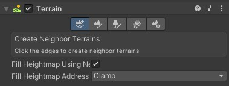
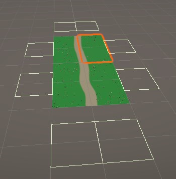
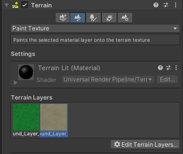
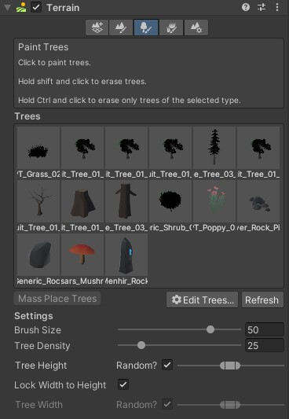
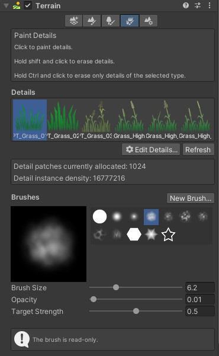
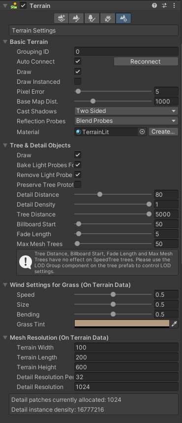
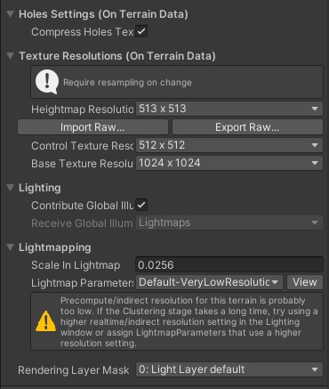

# Terrain

터레인은 지형을 간편하게 제작하기 위한 도구라고 볼 수 있다.
메뉴창의 3D Object - Terrain을 통해 간단하게 생성할 수 있다.
생성된 터레인은 Terrain과 Terrain Collider 컴포넌트를 기본적으로 갖고 있다.
이 중 Terrain 컴포넌트의 기능을 간단하게 정리해두고자 한다.

## 1. 터레인 추가

우선 첫번째로는 컴포넌트가 부착된 터레인 근처에 자동으로 사이즈가 같은 다른 터레인을 추가해주는 기능이다.

Terrain 컴포넌트의 첫번째 버튼이며, 이를 클릭하면 

이와 같이 에디터 창에 네모 모양으로 인접한 공간이 표시되고, 클릭하면 자동으로 터레인이 추가된다.

## 2. 터레인 변형

두번째 버튼은 터레인의 지형을 조절하거나, 지형을 칠할 수 있는 기능을 제공한다.

현재는 Paint Texture라 되어 있는 드롭다운 메뉴를 클릭하면 Raise or Lower Terrain, Paint Holes 등의 기능이 있다.
해당 기능들을 통해 칠해진 터레인을 지우거나, 지형 높낮이를 조절할 수 있다.

## 3. 터레인에 장식물 추가

세번째 버튼은 터레인에 각종 장식물을 추가할 수 있는 기능이다.
예를 들어, 나무나 바위같은 장식물을 간편하게 색칠하듯이 칠할 수 있다.

Edit Trees 버튼을 통해 장식물을 추가하거나, 수정하거나, 등록한 장식물을 제거할 수 있다.
Settings의 Brush Size를 통해 장식물을 추가할 범위를 조절하고, 
Tree Density를 통해 한번에 추가될 장식물의 수를 조절할 수 있다.

네번째 버튼 또한 비슷한 기능을 제공한다.
터레인에 2D 형식의 텍스쳐를 추가하거나, 특정 메쉬를 배치할 때 사용한다.
마찬가지로 Brush Size를 통해 칠할 범위를 조절할 수 있다.
Opacity와 Target Strength는 비슷한 역할을 하는 것 같은데, 배치되는 장식물의 수가 조절된다.
보다 정확히 말해서 Opacity는 불투명도를 뜻하니 이펙트의 강도를 말하는 것이고,
Target Strength는 타켓의 양을 뜻한다는데, 현재로서는 큰 차이가 있나 모르겠다.

## 4. 터레인 기본 설정

마지막 버튼에서는 터레인의 기본 설정을 조절할 수 있다.
아직 모든 기능을 다 아는 것은 아니지만, 터레인의 크기 조절이나, 해상도 등을 설정할 수 있다.