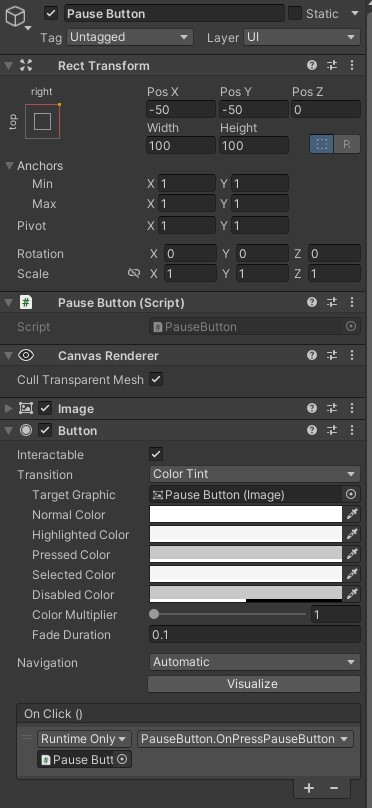
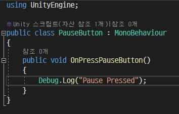
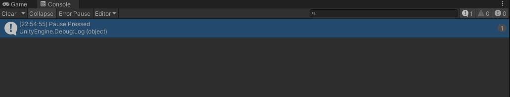
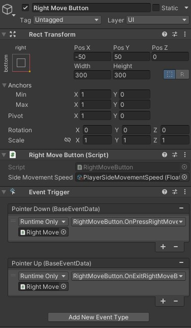
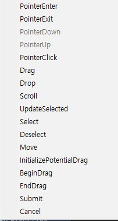
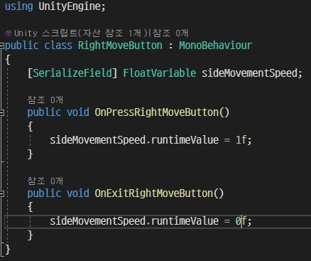

# Button

## 버튼 오브젝트 만들기

게임을 만들다 보면 버튼 UI는 무조건 사용하게 된다.  
유니티에서는 간편하게 버튼을 만들 수 있는 수단을 제공한다.

유니티에서 간단하게 메뉴를 통해 UI-Button(Button-TextMeshPro)를 클릭하면 자동으로 Canvas가 추가되고 
위의 이미지와 같은 컴포넌트를 지닌 버튼 오브젝트가 생성된다. 
이와 같이 생성한 버튼 오브젝트의 Button 컴포넌트의 OnClick()에 +버튼을 눌러 이벤트 리시버를 추가하고 
이에 반응할 대상과 메서드를 지정하면 간단하게 버튼 기능을 구현할 수 있다.

나는 위 오브젝트의 스크립트를 이와 같이 작성했다. 단순한 예시이다. 
이후 플레이 모드에서 이 버튼을 클릭하면

이와 같이 정상적으로 로그가 뜨는 것을 확인할 수 있다.

## 여러 상황에 반응하는 버튼 만들기

다만, 이것만으로는 뭔가 조금 부족하다.  
왜냐면 Button 컴포넌트의 OnClick은 단순히 클릭 시 반응밖에 지원하지 않는다. 
버튼을 클릭하면 그만이지 뭐가 더 필요한데? 라는 생각이 들 수 있지만...

생각해보면 버튼을 누를 때 뿐 아니라, 버튼을 땔 때 뭔가 반응을 해야 할 수도 있고, 
버튼을 일정 시간 눌러야만 반응이 일어나도록 해야 할 수도 있다. 
그 때는 Button 컴포넌트만으로는 뭔가 부족해진다.

하지만 유니티에서는 이러한 상황을 위한 컴포넌트도 이미 준비되어 있다.

버튼 역할을 할 오브젝트의 Button 컴포넌트를 제거하고, 'Event Trigger' 컴포넌트를 추가해주자. 
Add Component를 눌러 Event Trigger라고 검색하면 손쉽게 추가할 수 있다. 
여기서는 단순 클릭뿐 아니라, 다양한 종류의 이벤트에 반응하게 할 수 있다.

종류가 정말 다양하다. 이 중에서 필요한 이벤트를 골라서 추가하면 된다. 
Add New Event Type 버튼을 통해 이벤트를 계속 추가해줄 수 있다. 
나는 버튼을 누를 때와 땔 때 각각 반응을 할 버튼을 만들기 위해 Event Trigger를 활용했다.

이와 같이 스크립트를 작성하고, 버튼 역할을 할 오브젝트에 추가해준 뒤,  
앞서 본 이미지와 같이 각각 이벤트에 등록해주었다. 
Pointer Down은 버튼을 누를 때, Pointer Up은 버튼을 땔 때 반응한다.

다만, Event Trigger는 Button 컴포넌트와는 다르게,  
버튼을 누를 때 버튼의 색이나 크기가 변화한다던가 하는 효과는 없다. 
그러한 기능은 별도로 구현하거나, DoTween과 같은 편리한 에셋을 활용하면 좋을 것이다.